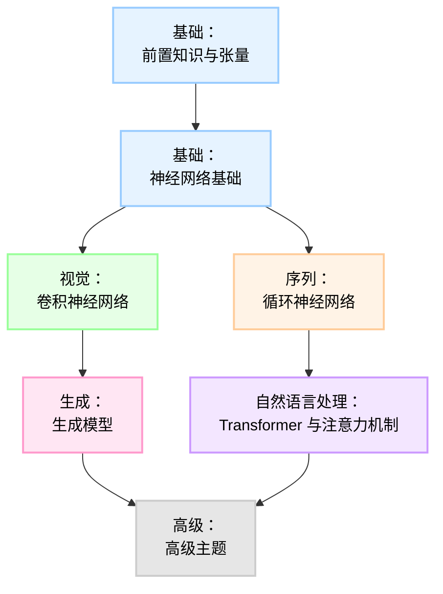

# 路线图

从零开始掌握机器学习的路径。

## 基础：前置知识与张量
在无自动微分的情况下掌握张量操作和基础数学运算。

**核心概念**

- 张量广播基础
- 矩阵乘法（朴素实现 vs 向量化实现）
- 逐元素操作
- 张量重塑与转置
- 归约操作（求和、均值、最大值）
- 向量范数（L1、L2）
- 点积与叉积
- Einstein 求和约定（einsum）
- 求和与矩阵乘法的梯度
- One-Hot 编码
- Softmax 实现
- 交叉熵损失（手动实现）
- 数值稳定性（Log-Sum-Exp）

## 基础：神经网络基础
从零构建 MLP，理解反向传播。

**核心概念**

- 线性层前向与反向传播
- ReLU 与 Sigmoid 激活函数
- Tanh 激活函数
- 均方误差（MSE）与二元交叉熵（BCE）损失
- 多分类交叉熵
- SGD、动量、RMSProp、Adam 优化器
- 权重初始化（Xavier/He）
- Dropout（反转 Dropout）
- 批归一化（Batch Normalization）
- 层归一化（Layer Normalization）

## 视觉：CNNs 卷积神经网络
视觉主干网络：Conv2d、池化、ResNet。

**核心概念**

- Conv2d 前向与反向传播
- 最大池化（MaxPool2d）与平均池化（AvgPool2d）
- 平均池化前向/反向传播
- 展平层（Flatten Layer）
- Im2Col 实现
- 填充工具
- CNN 模块（Conv-BN-ReLU）
- 残差连接
- 深度可分离卷积
- 全局平均池化
- 转置卷积前向与反向传播
- 空间金字塔池化
- 压缩与激励模块
- MobileNet 倒残差
- Vision Transformer 补丁嵌入
- ViT 类别 Token 与位置嵌入
- 局部响应归一化

## 生成：生成模型
图像生成与隐变量模型：从零实现 VAE、GAN 和扩散模型。

**核心概念**

- 自编码器（简单版）
- VAE 编码器前向传播
- 重参数化技巧
- VAE 解码器前向传播
- KL 散度损失（高斯分布）
- 重建损失（BCE/MSE）
- VAE 完整训练步骤
- GAN 生成器（线性）
- GAN 判别器（线性）
- GAN BCE 损失（极小极大）
- DCGAN 生成器（ConvTranspose）
- DCGAN 判别器（Conv）
- Wasserstein 损失（WGAN）
- 梯度惩罚（WGAN-GP）
- 条件 GAN（cGAN）嵌入
- CycleGAN 一致性损失
- DDPM 前向扩散过程
- DDPM 反向过程
- DDPM 训练目标
- 方差调度（线性/余弦）
- 无分类器引导（CFG）
- 隐扩散（LDM）概念
- UNet 下采样模块
- UNet 上采样模块
- UNet 时间嵌入

## 序列：RNNs 循环神经网络
序列建模基础：RNN、LSTM、GRU。

**核心概念**
- RNN 单元前向与反向传播
- RNN 前向序列（循环）
- RNN 反向序列（时间反向传播 BPTT）
- LSTM 单元前向与反向传播
- GRU 单元前向与反向传播
- 双向 RNN 逻辑
- 打包序列工具（掩码/填充）
- 梯度裁剪
- 序列到序列编码器
- 序列到序列解码器
- 教师强迫训练循环
- 束搜索解码
- 字符级 RNN（文本生成）
- 序列 1D 卷积
- 时间分布全连接层
- 注意力机制（Bahdanau/加法型）
- 注意力机制（Luong/乘法型）

## 自然语言处理：Transformer 与注意力机制
现代 NLP 与多模态主干网络。

**核心概念**

- 缩放点积注意力
- 多头注意力前向传播
- 多头注意力反向传播
- 位置编码（正弦余弦）
- 可学习位置嵌入
- 层归一化（Transformer 变体）
- 前馈网络（GELU/Swish）
- Transformer 编码器模块
- Transformer 解码器模块
- 因果掩码（前瞻掩码）
- 交叉注意力机制
- 微型 Transformer 端到端实现
- BERT 嵌入（Token + 段 + 位置）
- GPT-2 架构框架
- 旋转位置嵌入（RoPE）
- 相对位置编码（T5/ALiBi）
- 推理用键值缓存（KV-Cache）
- 分组查询注意力（GQA）
- 滑动窗口注意力
- 稀疏注意力模式
- Flash Attention（简化分块）
- 专家混合（MoE）路由器
- MoE Top-K 门控
- 字节对编码（BPE）分词器基础
- WordPiece 分词器基础

## 高级：高级主题
强化学习、图神经网络和优化。

**核心概念**

- 策略梯度损失
- 价值函数（Critic）损失
- PPO 裁剪目标
- Gumbel-Softmax 采样
- 图卷积层（GCN）
- 图注意力层（GAT）
- 消息传递接口
- 对比损失（SimCLR/InfoNCE）
- 三元组损失
- LoRA（低秩适应）层
- LoRA 权重合并
- 量化（Int8 矩阵乘法）
- 知识蒸馏损失（软标签）
- 标签平滑
- Focal Loss（用于类别不平衡）
- 梯度检查点（激活重计算）
- 分布式数据并行（梯度 All-Reduce）
- ZeRO 优化器 Stage 1（优化器状态分区）
- Mamba/SSM：选择性扫描算法
- Mamba：离散化步骤
- 偏好优化（DPO 损失）
- RLHF 奖励建模
