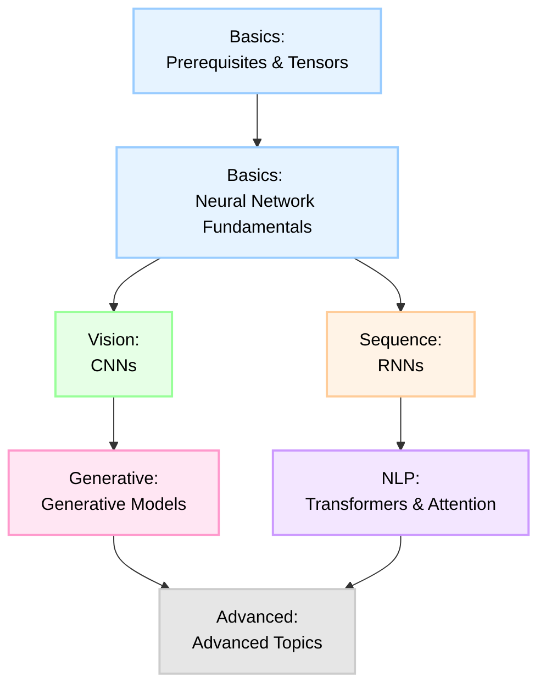

# roadmap

Follow the path to master Machine Learning from scratch.

## Basics: Prerequisites & Tensors
Master tensor manipulation and basic math ops without autograd.

**Core Concepts**

- Tensor Broadcasting Basics
- Matrix Multiplication (Naive vs Vectorized)
- Element-wise Operations
- Tensor Reshaping & Transposing
- Reduction Operations (Sum, Mean, Max)
- Vector Norms (L1, L2)
- Dot Product & Cross Product
- Einstein Summation (einsum)
- Gradient of Sum & MatMul
- One-Hot Encoding
- Softmax Implementation
- Cross-Entropy Loss (Manual)
- Numerical Stability (Log-Sum-Exp)

## Basics: Neural Network Fundamentals
Build an MLP from scratch, understanding backprop.

**Core Concepts**

- Linear Layer Forward & Backward
- ReLU & Sigmoid Activations
- Tanh Activation
- MSE & BCE Loss
- Categorical Cross Entropy
- SGD, Momentum, RMSProp, Adam
- Weight Initialization (Xavier/He)
- Dropout (Inverted)
- Batch Normalization
- Layer Normalization

## Vision: CNNs
Vision backbones: Conv2d, Pooling, ResNet.

**Core Concepts**

- Conv2d Forward & Backward
- MaxPool2d & AvgPool2d
- AveragePooling Forward/Backward
- Flatten Layer
- Im2Col Implementation
- Padding Utils
- CNN Block (Conv-BN-ReLU)
- Residual Connection
- Depthwise Separable Conv
- Global Average Pooling
- Transposed Convolution Forward & Backward
- Spatial Pyramid Pooling
- Squeeze-and-Excitation Block
- MobileNet Inverted Residual
- Vision Transformer Patch Embedding
- ViT Class Token & Positional Embedding
- Local Response Normalization

## Generative: Generative Models
Image generation and latent variable models: implementing VAEs, GANs, and Diffusion Models from scratch.

**Core Concepts**

- Autoencoder (Simple)
- VAE Encoder Forward
- Reparameterization Trick
- VAE Decoder Forward
- KL Divergence Loss (Gaussian)
- Reconstruction Loss (BCE/MSE)
- VAE Full Training Step
- GAN Generator (Linear)
- GAN Discriminator (Linear)
- GAN BCE Loss (Minimax)
- DCGAN Generator (ConvTranspose)
- DCGAN Discriminator (Conv)
- Wasserstein Loss (WGAN)
- Gradient Penalty (WGAN-GP)
- Conditional GAN (cGAN) Embedding
- CycleGAN Consistency Loss
- DDPM Forward Diffusion Process
- DDPM Reverse Process
- DDPM Training Objective
- Variance Schedule (Linear/Cosine)
- Classifier-Free Guidance (CFG)
- Latent Diffusion (LDM) Concept
- UNet Downsample Block
- UNet Upsample Block
- UNet Time Embedding

## Sequence: RNNs
Sequence modeling basics: RNN, LSTM, GRU.

**Core Concepts**

- RNN Cell Forward & Backward
- RNN Forward Sequence (Looping)
- RNN Backward Sequence (BPTT)
- LSTM Cell Forward & Backward
- GRU Cell Forward & Backward
- Bidirectional RNN Logic
- Packed Sequence Utils (Masking/Padding)
- Gradient Clipping
- Sequence-to-Sequence Encoder
- Sequence-to-Sequence Decoder
- Teacher Forcing Training Loop
- Beam Search Decoding
- Character-Level RNN (Text Generation)
- 1D Convolution for Sequences
- Time-Distributed Dense Layer
- Attention Mechanism (Bahdanau/Additive)
- Attention Mechanism (Luong/Multiplicative)

## NLP: Transformers & Attention
Modern NLP & Multimodal backbone.

**Core Concepts**

- Scaled Dot-Product Attention
- Multi-Head Attention Forward
- Multi-Head Attention Backward
- Positional Encoding (Sinusoidal)
- Learnable Positional Embedding
- Layer Normalization (Transformer variant)
- Feed-Forward Network (GELU/Swish)
- Transformer Encoder Block
- Transformer Decoder Block
- Causal Masking (Look-ahead mask)
- Cross-Attention Mechanism
- Tiny Transformer End-to-End
- BERT Embedding (Token + Segment + Position)
- GPT-2 Architecture Skeleton
- Rotary Positional Embedding (RoPE)
- Relative Positional Encoding (T5/ALiBi)
- Key-Value Cache (KV-Cache) for Inference
- Grouped Query Attention (GQA)
- Sliding Window Attention
- Sparse Attention Pattern
- Flash Attention (Simplified Tiling)
- Mixture of Experts (MoE) Router
- MoE Top-K Gating
- Byte-Pair Encoding (BPE) Tokenizer Basic
- WordPiece Tokenizer Basic

## Advanced: Advanced Topics
RL, Graph NN, and Optimization.

**Core Concepts**

- Policy Gradient Loss
- Value Function (Critic) Loss
- PPO Clipped Objective
- Gumbel-Softmax Sampling
- Graph Convolution Layer (GCN)
- Graph Attention Layer (GAT)
- Message Passing Interface
- Contrastive Loss (SimCLR/InfoNCE)
- Triplet Loss
- LoRA (Low-Rank Adaptation) Layer
- LoRA Merging Weights
- Quantization (Int8 Matrix Mul)
- Knowledge Distillation Loss (Soft Targets)
- Label Smoothing
- Focal Loss (for Class Imbalance)
- Gradient Checkpointing (Activation Recomputation)
- Distributed Data Parallel (Gradient All-Reduce)
- ZeRO Optimizer Stage 1 (Optimizer State Partitioning)
- Mamba/SSM: Selective Scan Algorithm
- Mamba: Discretization Step
- Preference Optimization (DPO Loss)
- RLHF Reward Modeling
