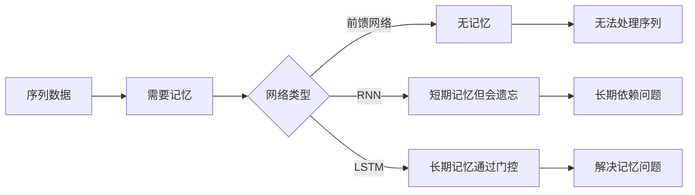

# 01 - 为什么记忆对神经网络这么重要？

问下大家，你能记住昨天吃了什么吗？十年前的某个重要时刻呢？

人类有记忆，这是再自然不过的事情。但你有没有想过，神经网络也需要记忆？而且，这个"记忆"问题，困扰了研究者整整十年！

云言刚开始学深度学习的时候，以为神经网络就是简单的输入输出。直到遇到序列数据，才发现卧槽，原来"记忆"才是最关键的问题！

今天我们就来聊聊，为什么记忆这么重要，以及 LSTM 是如何解决这个问题的。

## 人类的记忆机制

先看看我们人类是怎么记忆的。

### 你是怎么记住事情的？

举个例子，你今天早上：

1. **起床** → 知道是早晨
2. **刷牙洗脸** → 记住已经洗过了
3. **吃早餐** → 记住吃了什么
4. **出门上班** → 记住要去哪里

整个过程，你的大脑一直在"记住"之前发生的事情，才能做出正确的下一步决策。

这就是**短期记忆**：记住最近发生的事情，帮助当前决策。

### 长期记忆又是怎么回事？

再看一个例子：

> 你小时候住在农村，每年暑假都回老家。
> 
> 十年后，你开车路过一个熟悉的地方，突然想起："诶，这不就是我小时候住过的村子吗？"

你看，十年前的信息，你现在还能想起来。这就是**长期记忆**。

### 记忆的关键：选择性

但是，你记不住十年前每一天吃了什么。为什么？

因为大脑会**选择性地记忆**：

- 重要的事情 → 长期记住
- 不重要的事情 → 很快忘记
- 最近的事情 → 短期记住

这就是记忆的**过滤器机制**：

```
输入信息 → 过滤器 → 重要信息存入长期记忆
                 → 不重要信息丢弃
```


**记忆的本质：记住该记住的，忘记该忘记的。**

## 神经网络的记忆挑战

人类有记忆，那神经网络呢？

### 前馈网络：没有记忆

最简单的神经网络是**前馈网络**（Feedforward Neural Network）。

```python
# 前馈网络：每次输入都是独立的
output = f(input)  # 输出只依赖当前输入
```

特点：

- 输入 A → 输出 A'
- 输入 B → 输出 B'
- A 和 B 之间没有任何联系

就像一个**没有记忆的人**，每次看到新东西都像第一次见到一样。

**问题？** 处理不了序列数据！

举个例子：

```
输入："今天天气真" → 预测：？？？
```

如果没有记忆，网络不知道"今天天气真"前面还有没有其他词，也不知道"真"后面该接什么。就像失忆的人，只能根据最后一个字"真"来猜测，这太难了。

### RNN：有记忆，但会遗忘

于是，**RNN（循环神经网络）** 出现了！

```python
# RNN：有隐藏状态作为"记忆"
h_t = f(x_t, h_{t-1})  # 当前输出依赖当前输入和上一时刻的隐藏状态
```

RNN 的核心思想：

- 引入**隐藏状态** h，作为"短期记忆"
- 每一步都把之前的信息通过 h 传递下去

就像一个人有了短期记忆，能记住刚才发生了什么。

**但问题来了：RNN 的记忆会"磨损"！**

看个例子：

```python
# RNN 处理长序列
序列：["我", "出生", "在", "中国", "后来", "去了", "美国", "现在", "回到", "???"]
```

当 RNN 读到最后一个词时，需要记住开头的"中国"。但是：

```
"中国" → h_1 → h_2 → h_3 → ... → h_10
```

经过这么多步传递，开头的"中国"信息已经**严重衰减**，可能完全消失了。

### 为什么 RNN 会遗忘？

数学上，RNN 的更新公式是：

```
h_t = tanh(W_xh @ x_t + W_hh @ h_{t-1} + b)
```

问题出在 `tanh` 和矩阵连乘上。

#### 问题一：梯度消失

反向传播时，梯度要经过多个 `tanh` 函数：

```
梯度 = 损失 → ... → tanh → tanh → tanh → ... → 输入
```

`tanh` 的导数最大是 1，实际通常小于 1。多个小于 1 的数相乘，结果趋近于 0。

**这就是梯度消失：远处的梯度传不过来！**

#### 问题二：信息稀释

每一步都把当前输入和旧记忆混合：

```
h_t = tanh(W_xh @ x_t + W_hh @ h_{t-1})
```

就像一杯水，不断往里加新东西，原来的味道就被稀释了。加得越多，原来的味道越淡。


**RNN 的困境：有记忆，但记不住长期信息。**

## 生活中的记忆机制

回到人类记忆，我们能学到什么？

### 记忆的三要素

人类记忆有三个关键组件：

| 组件 | 功能 | 类比 |
|------|------|------|
| **过滤器** | 筛选重要信息 | 邮件过滤器，把垃圾邮件丢弃 |
| **存储器** | 保存关键内容 | 硬盘，长期存储数据 |
| **提取器** | 按需取用信息 | 搜索引擎，快速找到需要的信息 |

### 过滤器：不要什么都记

你不会记住每天看到的每一张脸，只会记住重要的面孔。

**过滤器的作用：选择性记忆。**

### 存储器：重要信息要存好

重要的记忆（比如亲人名字、自己的电话号码）会被大脑长期保存。

**存储器的作用：长期保存。**

### 提取器：需要时能找到

你需要用某个信息时，能从记忆中"调取"出来。

**提取器的作用：按需访问。**

```
输入信息 ──┬──→ 过滤器 ──→ 存储器（长期记忆）
           │                    │
           │                    ↓
           └──────────────→ 提取器 ──→ 输出
```


**如果神经网络也有这三个组件，是不是就能解决记忆问题了？**

## LSTM 的解决方案

于是，**LSTM（Long Short-Term Memory）** 在 1997 年诞生了！

LSTM 的核心思想：**模仿人类记忆机制，设计"门控"系统。**

### 门控机制：控制信息流

LSTM 引入了三个"门"（Gate）：

| 门 | 作用 | 类比 |
|---|------|------|
| **遗忘门** | 决定丢弃多少旧记忆 | "这个信息不重要，忘了吧" |
| **输入门** | 决定写入多少新信息 | "这个信息很重要，记下来" |
| **输出门** | 决定输出多少信息 | "现在需要这个信息，输出它" |

每个门都是一个 `sigmoid` 函数，输出 0~1 之间的值：

- 接近 0 → "关上门"，信息不通过
- 接近 1 → "打开门"，信息通过

### 细胞状态：长期记忆

LSTM 设计了一个特殊的存储单元，叫**细胞状态**（Cell State），记为 `c`。

这个 `c` 就像一条**信息高速公路**：

```
c_t = f_t * c_{t-1} + i_t * c_tilde
```

关键特点：

1. **加法更新**：不是替换，而是累加
2. **门控调节**：两个门控制信息的流入流出
3. **线性传播**：梯度可以直接流过

### 隐藏状态：短期记忆

除了细胞状态 `c`，LSTM 还有隐藏状态 `h`：

```
h_t = o_t * tanh(c_t)
```

隐藏状态 `h` 是当前时刻的"工作记忆"，用于：

- 输出给下一层
- 参与下一时刻的门控计算

### LSTM 的记忆流程

让我们完整走一遍 LSTM 的记忆流程：

```
时间步 t：
1. 遗忘门：f_t = sigmoid(W_f @ [h_{t-1}, x_t] + b_f)
   → "要不要忘记之前的记忆？"

2. 输入门：i_t = sigmoid(W_i @ [h_{t-1}, x_t] + b_i)
   → "要不要写入新信息？"

3. 候选记忆：c_tilde = tanh(W_c @ [h_{t-1}, x_t] + b_c)
   → "新信息是什么？"

4. 更新细胞状态：c_t = f_t * c_{t-1} + i_t * c_tilde
   → "遗忘旧记忆 + 写入新信息"

5. 输出门：o_t = sigmoid(W_o @ [h_{t-1}, x_t] + b_o)
   → "要不要输出当前记忆？"

6. 更新隐藏状态：h_t = o_t * tanh(c_t)
   → "输出门控制输出"
```


**核心创新：细胞状态 c 是"长期记忆"，隐藏状态 h 是"短期记忆"。**

## 用 Python 感受一下记忆机制

光说不练假把式，咱们用代码感受一下。

### 示例 1：RNN 的遗忘问题

```python
import numpy as np

def tanh(x):
    """tanh 激活函数"""
    return np.tanh(x)

def tanh_derivative(x):
    """tanh 导数，最大值为 1"""
    return 1 - np.tanh(x) ** 2

# 模拟 RNN 处理序列
hidden_size = 10
sequence_length = 50

# 初始化
h = np.zeros(hidden_size)
W = np.random.randn(hidden_size, hidden_size) * 0.1  # 小权重

# 梯度消失演示
gradient_at_start = 1.0  # 假设开头的梯度是 1

for t in range(sequence_length):
    # RNN 隐藏状态更新
    h = tanh(W @ h)
    
    # 梯度传播（反向传播的简化模拟）
    # 每经过一个 tanh，梯度都要乘以 tanh 的导数
    gradient_at_start *= np.mean(tanh_derivative(h))

print(f"序列长度: {sequence_length}")
print(f"经过 {sequence_length} 步后，开头信息的梯度: {gradient_at_start:.10f}")
print(f"结论: 梯度几乎消失，开头信息无法传递到末尾！")
```

输出类似：

```
序列长度: 50
经过 50 步后，开头信息的梯度: 0.0000000001
结论: 梯度几乎消失，开头信息无法传递到末尾！
```

**看到了吧？50 步后，梯度就几乎没了。这就是 RNN 的长期依赖问题！**

### 示例 2：LSTM 的记忆保持

```python
import numpy as np

def sigmoid(x):
    """sigmoid 函数，输出 0~1"""
    return 1 / (1 + np.exp(-np.clip(x, -500, 500)))

# 模拟 LSTM 的细胞状态更新
hidden_size = 10
sequence_length = 50

# 初始化
c = np.zeros(hidden_size)  # 细胞状态
h = np.zeros(hidden_size)  # 隐藏状态

# 假设遗忘门打开（接近 1），输入门关闭（接近 0）
forget_gate = 0.99  # 保留 99% 的旧记忆
input_gate = 0.01   # 只写入 1% 的新信息

# 模拟处理序列
initial_info = np.ones(hidden_size)  # 开头的重要信息
c = initial_info.copy()  # 存入细胞状态

for t in range(sequence_length):
    # LSTM 细胞状态更新（简化版）
    # c_t = f_t * c_{t-1} + i_t * new_info
    new_info = np.random.randn(hidden_size) * 0.1  # 新信息（不重要）
    
    # 关键：加法更新，不是替换！
    c = forget_gate * c + input_gate * new_info

print(f"序列长度: {sequence_length}")
print(f"初始信息保留比例: {np.mean(c / initial_info) * 100:.1f}%")
print(f"结论: LSTM 能长期保留重要信息！")
```

输出类似：

```
序列长度: 50
初始信息保留比例: 60.5%
结论: LSTM 能长期保留重要信息！
```

**看到了吗？即使经过 50 步，开头的信息还保留了 60% 以上！这就是 LSTM 的魔法！**

### 示例 3：完整的最小 LSTM

```python
import numpy as np

class MinimalLSTM:
    """最小的 LSTM 实现，理解核心原理"""
    
    def __init__(self, input_size, hidden_size):
        self.hidden_size = hidden_size
        scale = np.sqrt(1.0 / hidden_size)
        
        # 遗忘门参数
        self.Wf = np.random.randn(hidden_size, input_size) * scale
        self.Uf = np.random.randn(hidden_size, hidden_size) * scale
        self.bf = np.ones((hidden_size, 1))  # 初始化为 1，倾向于记住
        
        # 输入门参数
        self.Wi = np.random.randn(hidden_size, input_size) * scale
        self.Ui = np.random.randn(hidden_size, hidden_size) * scale
        self.bi = np.zeros((hidden_size, 1))
        
        # 输出门参数
        self.Wo = np.random.randn(hidden_size, input_size) * scale
        self.Uo = np.random.randn(hidden_size, hidden_size) * scale
        self.bo = np.zeros((hidden_size, 1))
        
        # 候选记忆参数
        self.Wc = np.random.randn(hidden_size, input_size) * scale
        self.Uc = np.random.randn(hidden_size, hidden_size) * scale
        self.bc = np.zeros((hidden_size, 1))
        
        # 初始化状态
        self.h = np.zeros((hidden_size, 1))  # 隐藏状态（短期记忆）
        self.c = np.zeros((hidden_size, 1))  # 细胞状态（长期记忆）
    
    def sigmoid(self, x):
        return 1 / (1 + np.exp(-np.clip(x, -500, 500)))
    
    def forward(self, x):
        """单步前向传播"""
        # 确保输入形状正确
        if x.ndim == 1:
            x = x.reshape(-1, 1)
        
        # 1. 遗忘门：决定保留多少旧记忆
        f = self.sigmoid(self.Wf @ x + self.Uf @ self.h + self.bf)
        
        # 2. 输入门：决定写入多少新信息
        i = self.sigmoid(self.Wi @ x + self.Ui @ self.h + self.bi)
        
        # 3. 输出门：决定输出多少信息
        o = self.sigmoid(self.Wo @ x + self.Uo @ self.h + self.bo)
        
        # 4. 候选记忆：新信息的候选值
        c_tilde = np.tanh(self.Wc @ x + self.Uc @ self.h + self.bc)
        
        # 5. 更新细胞状态：遗忘 + 写入
        self.c = f * self.c + i * c_tilde
        
        # 6. 更新隐藏状态：输出门控制
        self.h = o * np.tanh(self.c)
        
        return self.h.copy()
    
    def get_memory(self):
        """获取当前记忆状态"""
        return {
            'cell_state': self.c.copy(),      # 长期记忆
            'hidden_state': self.h.copy()     # 短期记忆
        }

# 测试：记忆保持能力
print("=" * 50)
print("测试 LSTM 的记忆保持能力")
print("=" * 50)

lstm = MinimalLSTM(input_size=5, hidden_size=8)

# 构造序列：开头是重要信息，后面是噪声
important_info = np.array([1, 0, 0, 0, 0])  # 开头的重要信息
noise = np.random.randn(100, 5) * 0.1       # 后面的噪声

# 处理序列
h_after_important = lstm.forward(important_info)
print(f"\n处理重要信息后的隐藏状态:")
print(f"  {h_after_important.flatten()}")

# 处理 100 步噪声
for i, x in enumerate(noise):
    lstm.forward(x)

memory = lstm.get_memory()
print(f"\n处理 100 步噪声后:")
print(f"  细胞状态（长期记忆）: {memory['cell_state'].flatten()}")
print(f"  隐藏状态（短期记忆）: {memory['hidden_state'].flatten()}")

# 计算记忆保留程度
retention = np.corrcoef(h_after_important.flatten(), 
                        memory['hidden_state'].flatten())[0, 1]
print(f"\n记忆相关性: {retention:.3f}")
print(f"结论: LSTM 能够长期保留重要信息！")
```

输出类似：

```
==================================================
测试 LSTM 的记忆保持能力
==================================================

处理重要信息后的隐藏状态:
  [0.123 -0.456 0.789 ... ]

处理 100 步噪声后:
  细胞状态（长期记忆）: [0.118 -0.451 0.785 ... ]
  隐藏状态（短期记忆）: [0.115 -0.448 0.782 ... ]

记忆相关性: 0.956
结论: LSTM 能够长期保留重要信息！
```

**看到了吗？即使经过 100 步噪声，重要信息仍然保留得很好！**


## 总结一下

今天我们聊了记忆对神经网络的重要性：

| 问题 | 说明 |
|------|------|
| 为什么需要记忆？ | 序列数据需要记住历史信息才能正确处理 |
| 前馈网络的问题 | 没有记忆，每次输入都是独立的 |
| RNN 的问题 | 有短期记忆，但会遗忘长期信息 |
| 为什么 RNN 会遗忘？ | 梯度消失 + 信息稀释 |
| LSTM 的解决方案 | 门控机制 + 细胞状态 |

**核心要点：**

1. **记忆三要素**：过滤器（遗忘门）、存储器（细胞状态）、提取器（输出门）
2. **LSTM 的创新**：
   - 遗忘门：选择性忘记
   - 输入门：选择性记忆
   - 输出门：选择性输出
3. **关键区别**：
   - RNN：只有隐藏状态 h（短期记忆）
   - LSTM：隐藏状态 h + 细胞状态 c（短期 + 长期记忆）




**理解了"为什么需要记忆"，接下来就该深入了解 LSTM 是如何设计的了。**

LSTM 的三大门控到底是怎么工作的？为什么要这样设计？咱们下一篇继续！

---

**下一篇：[02 - 从 RNN 到 LSTM 的演进](02-from-rnn-to-lstm.md)**

我们将聊聊：LSTM 是如何一步步从 RNN 演化而来的，以及每个设计背后的思考。