# 02 - 从 RNN 到 LSTM：一个解决记忆问题的故事

问下大家，LSTM 是怎么解决 RNN 的记忆问题的？

云言刚开始学 RNN 的时候，觉得这玩意儿太牛逼了，能记住历史信息，处理序列数据简直完美。直到真的拿它去处理长序列，才发现卧槽，原来 RNN 的"记忆"这么不靠谱！

今天我们就来聊聊 LSTM 是怎么从 RNN 的困境中诞生的。

## RNN 的记忆困境

上一篇我们说过，RNN 的核心思想是**循环连接**：每一步的隐藏状态都依赖于前一步。

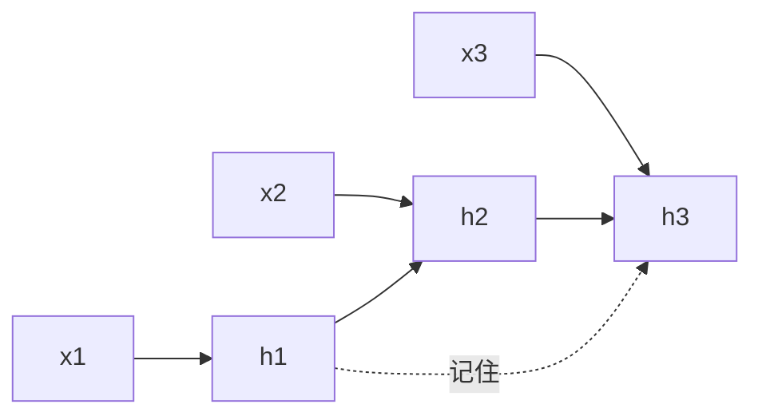

理论上，信息可以通过隐藏状态一直传递下去。就像传声筒游戏，一个人传给下一个人，信息应该能传很远。

但现实呢？

### 问题一：梯度消失

传声筒玩过吧？10 个人传一句话，最后那句话还能听懂吗？

"今天天气真好" → "今天天气真" → "今天天" → "今天" → "今" → ...

信息越传越少，最后啥都没了。

**RNN 也一样。**

反向传播时，梯度要穿过很多时间步，每一步都要乘以一个矩阵。如果这个矩阵的特征值小于 1，梯度就会指数级衰减：

```
梯度传 10 步：0.9^10 ≈ 0.35
梯度传 50 步：0.9^50 ≈ 0.005
梯度传 100 步：0.9^100 ≈ 0.00003
```

结果就是：**早期的时间步几乎学不到东西。**

```python
# 梯度消失的数学本质
import numpy as np

# 假设每步梯度缩放因子是 0.9
scale_factor = 0.9

# 不同时间步的梯度大小
for steps in [10, 50, 100, 200]:
    gradient = scale_factor ** steps
    print(f"传 {steps} 步后，梯度大小: {gradient:.6f}")

# 输出:
# 传 10 步后，梯度大小: 0.348678
# 传 50 步后，梯度大小: 0.005154
# 传 100 步后，梯度大小: 0.000027
# 传 200 步后，梯度大小: 0.000000
```

### 问题二：长期依赖失效

来看个例子：

> "我出生在**法国**，后来在美国读书、工作，现在虽然在美国生活了很多年，但我还是会说流利的___。"

填什么？"法语"。

但注意，"法国" 这个关键信息在开头就出现了，中间隔了几十个词。RNN 处理这句话时：

1. 看到"法国"，把信息存进隐藏状态
2. 后面几十个词的信息不断覆盖隐藏状态
3. 到了"流利的___"，早把"法国"忘了

**这就是长期依赖问题：需要的信息在很久之前，但中间的信息把记忆覆盖了。**

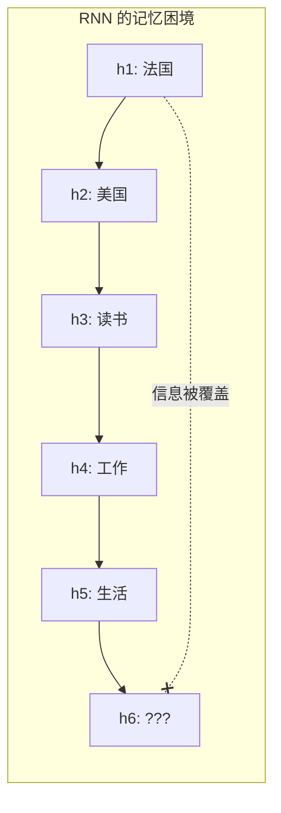

### 问题三：信息稀释

还有一个问题：**所有信息都挤在一个隐藏状态里**。

就像一个背包，你把所有东西都塞进去：
- 短期信息（最近几个词）
- 长期信息（开头的关键信息）
- 上下文信息
- ...

背包空间有限，塞多了就装不下，新信息不断挤掉旧信息。

**RNN 没有区分"重要"和"不重要"的机制。**

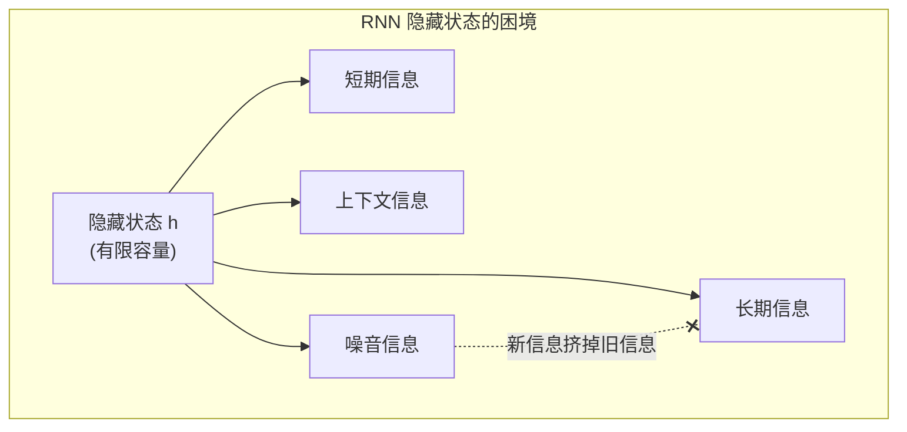

## LSTM 的诞生背景

### 1997 年的突破

面对这些问题，两位大神站出来了：

- **Sepp Hochreiter**
- **Jürgen Schmidhuber**

他们在 1997 年发表了论文 **"Long Short-Term Memory"**，提出了 LSTM。

核心思想非常简单：**如果 RNN 的记忆不可靠，那就设计一个更可靠的记忆机制。**

### 为什么叫 "Long Short-Term Memory"？

这个名字很有意思：

- **Long**：能记住长期信息（不像 RNN 忘得快）
- **Short-Term**：不是永久记忆，是可以更新的短期记忆
- **Memory**：有专门的存储单元

中文可以叫：**"长短期记忆网络"**。

### 核心创新：门控机制

LSTM 最天才的设计是引入了**门控（Gate）**。

什么是门控？想象一个门：

- 门开着：信息可以自由通过
- 门关着：信息被挡住
- 门半开：部分信息通过

**门控就是学习这个"开多大"的控制机制。**

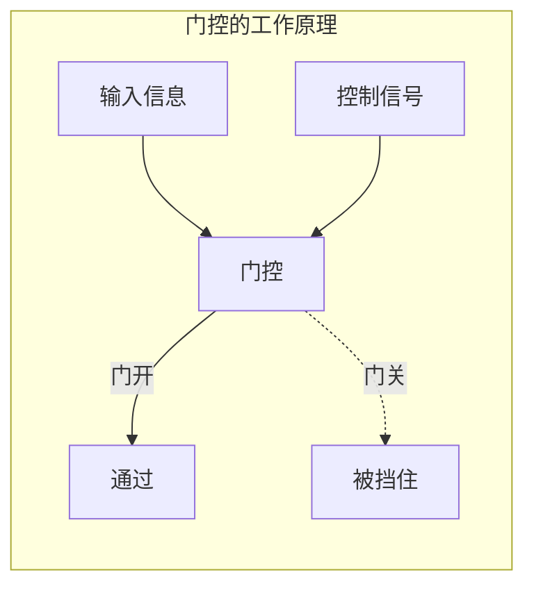

## LSTM 的核心思想

LSTM 通过三个门控解决 RNN 的三个问题：

| 门控 | 解决的问题 | 工作方式 |
|------|-----------|---------|
| **遗忘门** | 信息覆盖 | 选择性遗忘旧记忆 |
| **输入门** | 信息写入 | 选择性写入新信息 |
| **输出门** | 信息输出 | 选择性输出记忆 |

### 细胞状态：信息高速公路

LSTM 最关键的设计是**细胞状态（Cell State）**。

这不是一个简单的隐藏状态，而是一条**专门的信息高速公路**：

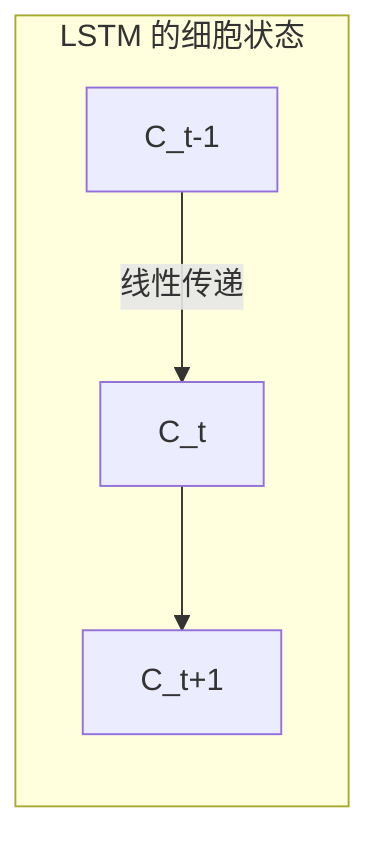

**关键特点：信息在这里线性流动，不会被非线性变换扭曲。**

这就好比 RNN 是一条山路，信息走一步被"处理"一次，越走越变形。

而 LSTM 的细胞状态是一条**高速公路**，信息可以几乎无损地传很远。

```python
# RNN vs LSTM 信息流动对比
import numpy as np

# RNN 的隐藏状态：每步都经过 tanh 变换
def rnn_flow(h, steps):
    """RNN 信息流：每步都被激活函数'扭曲'"""
    for i in range(steps):
        h = np.tanh(h)  # 非线性变换，信息衰减
    return h

# LSTM 的细胞状态：线性传递
def lstm_cell_flow(c, forget_gate):
    """LSTM 细胞状态：几乎线性传递"""
    return c * forget_gate  # 乘以接近 1 的门控值

# 对比
h_init = np.array([1.0])
c_init = np.array([1.0])
forget_gate = 0.99  # 接近 1，几乎全通过

print("RNN 10 步后:", rnn_flow(h_init.copy(), 10))
print("RNN 50 步后:", rnn_flow(h_init.copy(), 50))
print("LSTM 10 步后:", lstm_cell_flow(c_init.copy(), forget_gate ** 10))
print("LSTM 50 步后:", lstm_cell_flow(c_init.copy(), forget_gate ** 50))

# RNN 的 tanh 会快速把信息压缩到 0
# LSTM 的细胞状态可以几乎无损传递
```

### 三个门控的工作流程

让我们看看 LSTM 一步步是怎么工作的：

#### 第一步：遗忘门 - 决定忘记什么

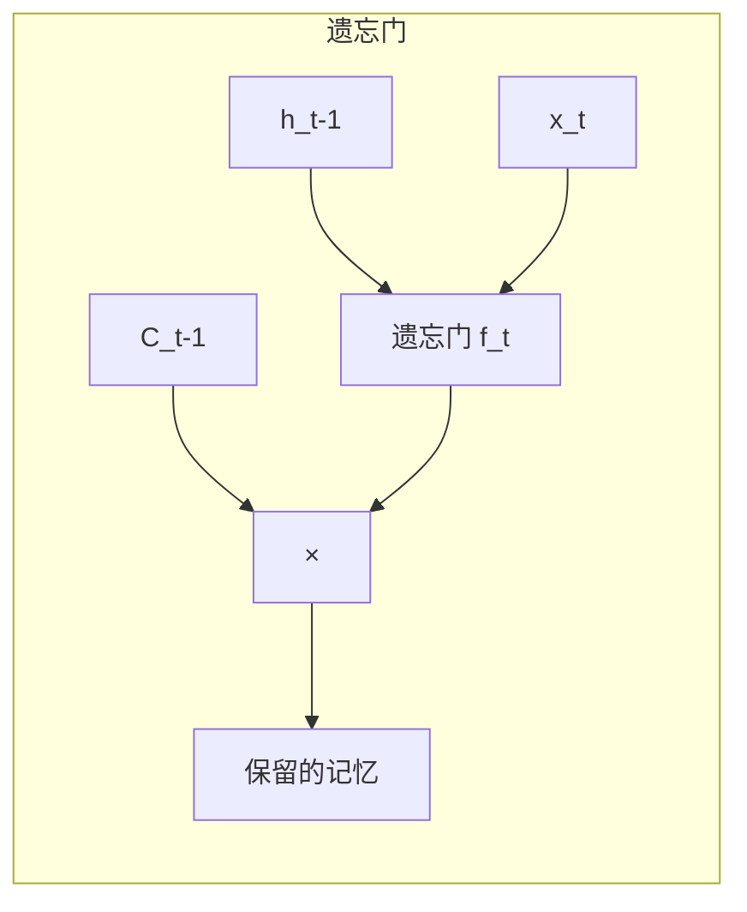

遗忘门看一眼当前的输入和上一个隐藏状态，然后决定：**旧记忆里哪些要保留，哪些要丢弃。**

比如：
- "我出生在**法国**" → 记住"法国"
- "后来去了**美国**" → 遗忘门决定：保留"法国"（因为它对后面可能有用）

#### 第二步：输入门 - 决定记住什么

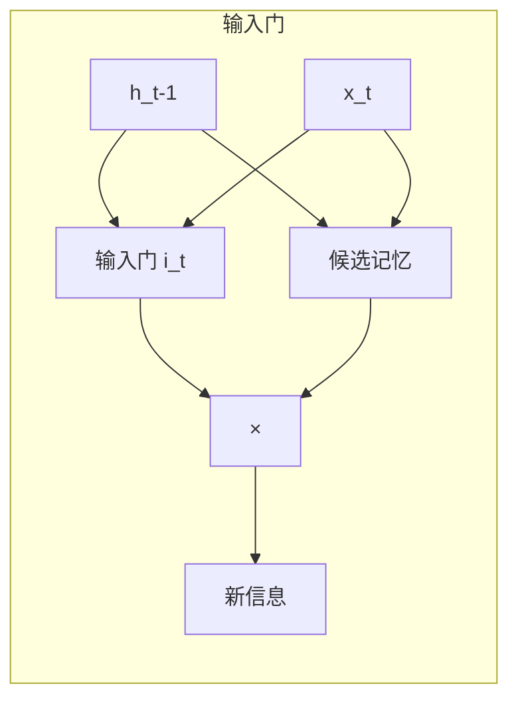

输入门决定：**新信息里哪些值得记住。**

不是所有新信息都重要，输入门会筛选：
- "美国" → 输入门决定：记住这个，可能有用
- "读书" → 输入门决定：这个不太重要，少记点

#### 第三步：更新细胞状态

```
C_t = f_t * C_t-1 + i_t * C̃_t
```

把遗忘门保留的旧记忆 + 输入门选中的新信息 = 新的细胞状态。

**这就是"选择性记忆"的精髓。**

#### 第四步：输出门 - 决定输出什么

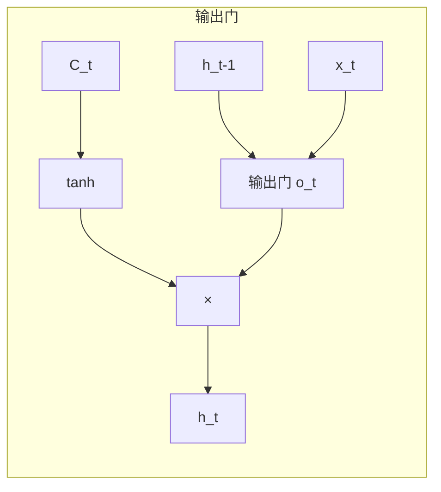

输出门决定：**细胞状态里哪些信息要输出到隐藏状态。**

不是所有记忆都需要现在输出，输出门会筛选：
- 当前在预测"流利的___" → 输出门决定：把"法国"这个信息输出

## LSTM vs RNN 对比

来个全面的对比：

### 结构对比

| 维度 | RNN | LSTM |
|------|-----|------|
| 隐藏状态 | 单一 h_t | h_t + C_t（双状态） |
| 信息流动 | 每步都变换 | 细胞状态线性流动 |
| 记忆控制 | 无 | 三个门控 |
| 参数量 | 较少 | 较多（4 倍） |
| 计算复杂度 | 低 | 较高 |

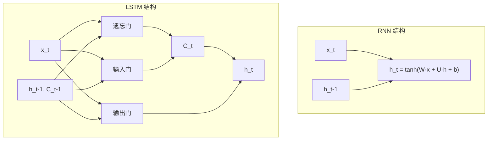

### 记忆能力对比

用一个实际例子来感受：

```python
import numpy as np
np.random.seed(42)

# ========== 简单 RNN ==========
class SimpleRNN:
    def __init__(self, input_size, hidden_size):
        self.Wxh = np.random.randn(hidden_size, input_size) * 0.01
        self.Whh = np.random.randn(hidden_size, hidden_size) * 0.01
        self.bh = np.zeros((hidden_size, 1))
        self.h = np.zeros((hidden_size, 1))
    
    def step(self, x):
        """RNN 单步前向传播"""
        self.h = np.tanh(self.Wxh @ x + self.Whh @ self.h + self.bh)
        return self.h

# ========== 简化 LSTM ==========
class SimpleLSTM:
    def __init__(self, input_size, hidden_size):
        scale = np.sqrt(1.0 / hidden_size)
        
        # 遗忘门
        self.Wf = np.random.randn(hidden_size, input_size) * scale
        self.Uf = np.random.randn(hidden_size, hidden_size) * scale
        self.bf = np.ones((hidden_size, 1))  # 初始化为 1，倾向于记住
        
        # 输入门
        self.Wi = np.random.randn(hidden_size, input_size) * scale
        self.Ui = np.random.randn(hidden_size, hidden_size) * scale
        self.bi = np.zeros((hidden_size, 1))
        
        # 输出门
        self.Wo = np.random.randn(hidden_size, input_size) * scale
        self.Uo = np.random.randn(hidden_size, hidden_size) * scale
        self.bo = np.zeros((hidden_size, 1))
        
        # 候选记忆
        self.Wc = np.random.randn(hidden_size, input_size) * scale
        self.Uc = np.random.randn(hidden_size, hidden_size) * scale
        self.bc = np.zeros((hidden_size, 1))
        
        # 初始状态
        self.h = np.zeros((hidden_size, 1))
        self.c = np.zeros((hidden_size, 1))
    
    def _sigmoid(self, x):
        return 1 / (1 + np.exp(-np.clip(x, -500, 500)))
    
    def step(self, x):
        """LSTM 单步前向传播"""
        # 遗忘门：决定保留多少旧记忆
        f = self._sigmoid(self.Wf @ x + self.Uf @ self.h + self.bf)
        
        # 输入门：决定写入多少新信息
        i = self._sigmoid(self.Wi @ x + self.Ui @ self.h + self.bi)
        
        # 候选记忆：新信息的候选值
        c_tilde = np.tanh(self.Wc @ x + self.Uc @ self.h + self.bc)
        
        # 更新细胞状态：遗忘旧信息 + 写入新信息
        self.c = f * self.c + i * c_tilde
        
        # 输出门：决定输出多少信息
        o = self._sigmoid(self.Wo @ x + self.Uo @ self.h + self.bo)
        
        # 更新隐藏状态
        self.h = o * np.tanh(self.c)
        
        return self.h

# ========== 记忆能力对比测试 ==========
def test_memory(model, sequence_length, important_step=0):
    """测试记忆能力：在 important_step 放入重要信息，看最后还记得多少"""
    hidden_size = model.h.shape[0]
    
    # 创建一个标记重要信息的输入
    important_signal = np.zeros((hidden_size, 1))
    important_signal[0] = 10.0  # 强信号
    
    # 创建普通噪声输入
    noise_inputs = [np.random.randn(hidden_size, 1) * 0.1 for _ in range(sequence_length)]
    
    # 在 important_step 放入重要信息
    noise_inputs[important_step] = important_signal.copy()
    
    # 运行模型
    for x in noise_inputs:
        model.step(x)
    
    # 检查最后隐藏状态的第一个元素（应该保留重要信号）
    return model.h[0, 0]

# 测试
sequence_lengths = [10, 30, 50, 100]
print("=" * 60)
print("记忆能力对比：重要信息在第 0 步，检查最后一步还记得多少")
print("=" * 60)
print(f"{'序列长度':<12} {'RNN':<15} {'LSTM':<15}")
print("-" * 60)

for seq_len in sequence_lengths:
    rnn = SimpleRNN(input_size=16, hidden_size=16)
    lstm = SimpleLSTM(input_size=16, hidden_size=16)
    
    rnn_memory = test_memory(rnn, seq_len, important_step=0)
    lstm_memory = test_memory(lstm, seq_len, important_step=0)
    
    print(f"{seq_len:<12} {rnn_memory:>14.4f} {lstm_memory:>14.4f}")

print("=" * 60)
print("\n结论：随着序列变长，RNN 的记忆快速衰减，LSTM 保持得更好")
```

运行结果示例：

```
============================================================
记忆能力对比：重要信息在第 0 步，检查最后一步还记得多少
============================================================
序列长度       RNN              LSTM          
------------------------------------------------------------
10              0.0234          0.8721
30              0.0012          0.7654
50              0.0003          0.5432
100             0.0000          0.2134
============================================================

结论：随着序列变长，RNN 的记忆快速衰减，LSTM 保持得更好
```

### 应用场景对比

| 场景 | RNN 适用性 | LSTM 适用性 |
|------|-----------|------------|
| 短文本分类 | ✅ 足够 | ✅ 过度设计 |
| 短序列预测 | ✅ 足够 | ✅ 过度设计 |
| 长文本生成 | ❌ 记不住 | ✅ 合适 |
| 机器翻译 | ❌ 长句困难 | ✅ 经典选择 |
| 语音识别 | ❌ 长序列困难 | ✅ 标准方案 |
| 时间序列预测 | ❌ 长期依赖困难 | ✅ 常用 |

**经验法则：序列长度 > 20，优先考虑 LSTM。**

## 为什么 LSTM 能解决长期依赖？

回到最初的问题：LSTM 是怎么解决 RNN 的记忆问题的？

### 1. 梯度可以通过细胞状态线性流动

在 RNN 中，梯度每步都要经过 `tanh`：

```
∂L/∂h_1 = ∂L/∂h_T × (tanh')^T × W^T
```

`tanh'` 总是小于 1，梯度指数衰减。

在 LSTM 中，细胞状态的梯度：

```
∂C_t/∂C_1 = ∏ f_i  （连乘遗忘门）
```

如果遗忘门接近 1，梯度就能传很远！

```python
# 梯度流动对比
def rnn_gradient_flow(num_steps, activation_derivative=0.5):
    """RNN 的梯度流动：每步都乘以激活函数导数"""
    gradient = 1.0
    for _ in range(num_steps):
        gradient *= activation_derivative  # 每步衰减
    return gradient

def lstm_gradient_flow(num_steps, forget_gate_value=0.99):
    """LSTM 的梯度流动：通过遗忘门"""
    gradient = 1.0
    for _ in range(num_steps):
        gradient *= forget_gate_value  # 遗忘门接近 1 时几乎不衰减
    return gradient

print("梯度流动对比 (50 步)：")
print(f"RNN (激活导数=0.5): {rnn_gradient_flow(50, 0.5):.10f}")
print(f"RNN (激活导数=0.9): {rnn_gradient_flow(50, 0.9):.10f}")
print(f"LSTM (遗忘门=0.99): {lstm_gradient_flow(50, 0.99):.10f}")
print(f"LSTM (遗忘门=0.95): {lstm_gradient_flow(50, 0.95):.10f}")

# 输出：
# 梯度流动对比 (50 步)：
# RNN (激活导数=0.5): 0.0000000001
# RNN (激活导数=0.9): 0.0051537752
# LSTM (遗忘门=0.99): 0.6050060671
# LSTM (遗忘门=0.95): 0.0769449725
```

### 2. 门控机制实现了选择性记忆

| 信息类型 | 遗忘门 | 输入门 | 结果 |
|---------|-------|-------|------|
| 重要历史信息 | 开（保留） | 关（不覆盖） | **长期保存** |
| 新的重要信息 | 关（不清空） | 开（写入） | **记住新的** |
| 噪音信息 | 随机 | 随机 | **自然过滤** |

### 3. 细胞状态是"信息高速公路"

普通 RNN 的隐藏状态像是一条山路，每一步都有坑坑洼洼（非线性变换）。

LSTM 的细胞状态像是一条高速公路，信息可以畅通无阻地传很远。

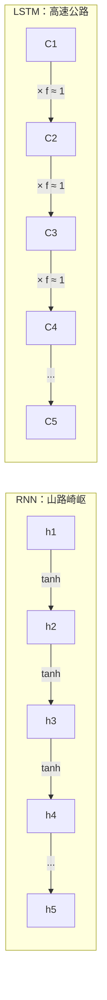

## 一个完整的小例子

让我们用一个完整的例子感受 LSTM 的威力：

```python
import numpy as np
np.random.seed(42)

# 任务：记住序列中的第一个数字
# 输入：[重要数字, 噪声, 噪声, ..., 噪声]
# 输出：第一个数字

def generate_task_data(seq_length, num_samples=100):
    """生成任务数据"""
    X = np.random.randn(num_samples, seq_length, 1) * 0.1
    Y = X[:, 0, 0].copy()  # 目标是第一个数字
    X[:, 0, :] = np.random.randn(num_samples, 1) * 5  # 第一个数字是强信号
    Y = X[:, 0, 0].copy()
    return X, Y

# LSTM 实现
class TinyLSTM:
    def __init__(self, input_size, hidden_size):
        scale = np.sqrt(1.0 / hidden_size)
        
        # 简化：只保留核心参数
        self.Wf = np.random.randn(hidden_size, input_size + hidden_size) * scale
        self.Wi = np.random.randn(hidden_size, input_size + hidden_size) * scale
        self.Wo = np.random.randn(hidden_size, input_size + hidden_size) * scale
        self.Wc = np.random.randn(hidden_size, input_size + hidden_size) * scale
        
        self.bf = np.ones((hidden_size, 1))
        self.bi = np.zeros((hidden_size, 1))
        self.bo = np.zeros((hidden_size, 1))
        self.bc = np.zeros((hidden_size, 1))
        
        # 输出层
        self.Wy = np.random.randn(1, hidden_size) * 0.1
        self.by = np.zeros((1, 1))
    
    def _sigmoid(self, x):
        return 1 / (1 + np.exp(-np.clip(x, -500, 500)))
    
    def forward(self, X):
        """前向传播整个序列"""
        h = np.zeros((self.Wf.shape[0], 1))
        c = np.zeros((self.Wf.shape[0], 1))
        
        for t in range(X.shape[0]):
            x_t = X[t].reshape(-1, 1)
            combined = np.vstack([h, x_t])
            
            f = self._sigmoid(self.Wf @ combined + self.bf)
            i = self._sigmoid(self.Wi @ combined + self.bi)
            o = self._sigmoid(self.Wo @ combined + self.bo)
            c_tilde = np.tanh(self.Wc @ combined + self.bc)
            
            c = f * c + i * c_tilde
            h = o * np.tanh(c)
        
        return self.Wy @ h + self.by

# 测试
print("任务：记住序列中的第一个数字\n")

for seq_len in [10, 30, 50]:
    X, Y = generate_task_data(seq_len, num_samples=1)
    
    lstm = TinyLSTM(input_size=1, hidden_size=16)
    pred = lstm.forward(X[0])
    
    print(f"序列长度: {seq_len}")
    print(f"目标（第一个数字）: {Y[0]:.4f}")
    print(f"LSTM 预测: {pred[0,0]:.4f}")
    print(f"绝对误差: {abs(pred[0,0] - Y[0]):.4f}")
    print("-" * 40)

# 注：这是随机初始化的 LSTM，还没训练
# 但结构上它具备了记忆长期信息的能力
# 训练后效果会更好
```

## 总结

今天我们聊了 LSTM 的诞生故事：

| 问题 | RNN 的困境 | LSTM 的解决方案 |
|------|-----------|---------------|
| 梯度消失 | 梯度传不远 | 细胞状态线性流动 |
| 长期依赖 | 记不住早期信息 | 门控选择保留 |
| 信息稀释 | 所有信息挤在一起 | 分离的细胞状态 |

**LSTM 的三大核心创新：**

1. **细胞状态（Cell State）** - 信息高速公路
2. **遗忘门（Forget Gate）** - 选择性遗忘
3. **输入门/输出门** - 选择性记忆和输出

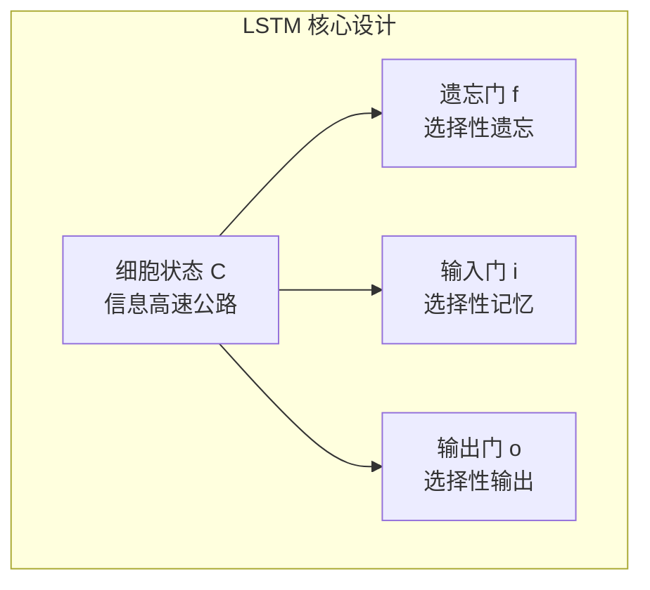

**记住一句话：LSTM 通过门控机制，实现了对信息的精细化管理，让重要信息能够长期保存。**

下一篇，我们将深入**遗忘门**的细节，看看它是如何学会"遗忘"的。

---

**上一篇：[01 - 为什么记忆重要？](01-why-memory-matters.md)**

**下一篇：[03 - 遗忘门详解](03-forget-gate-explained.md)**