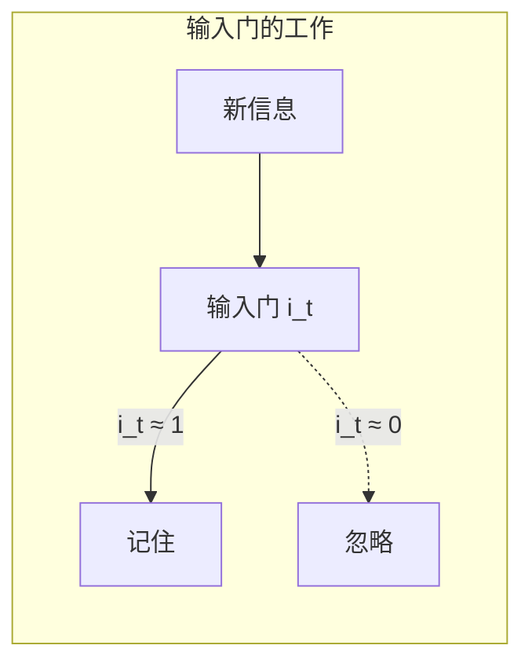
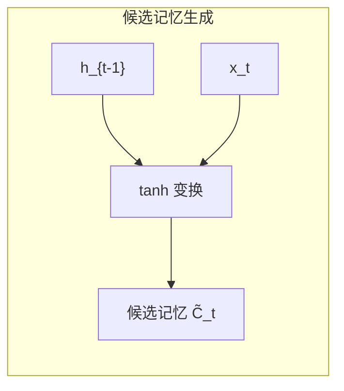
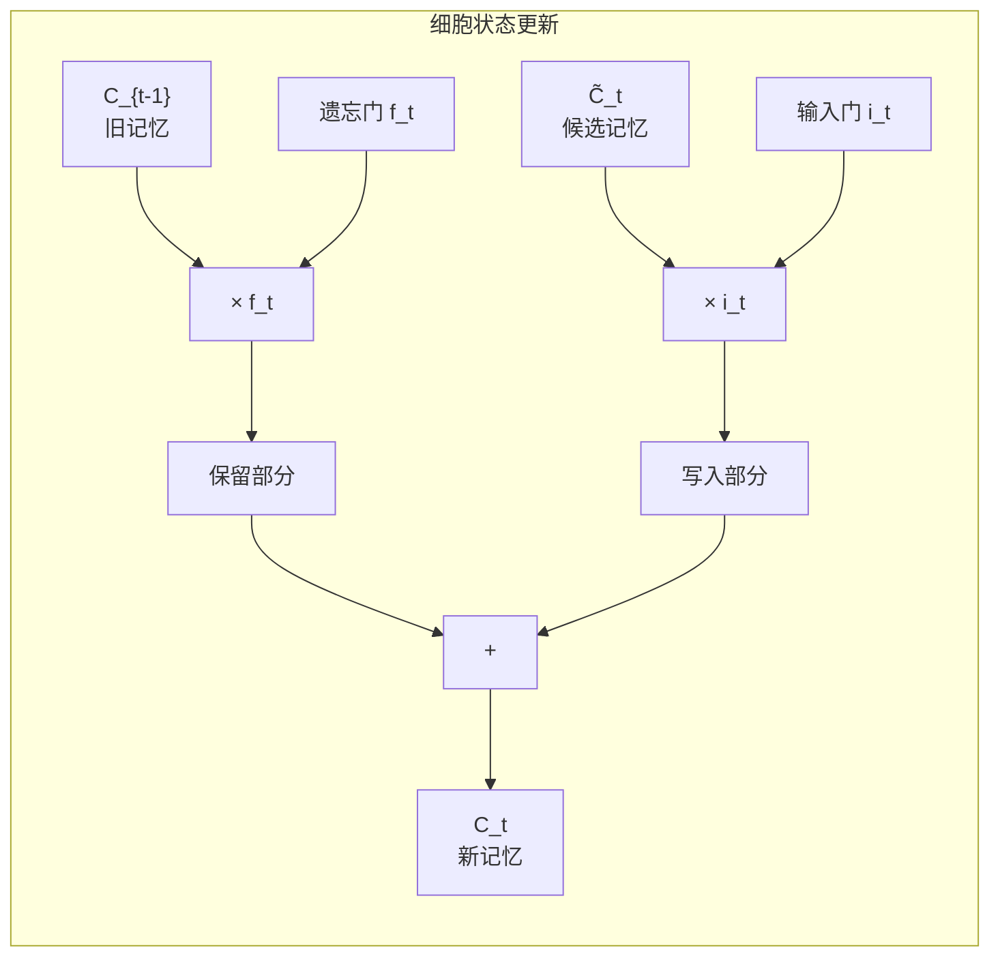
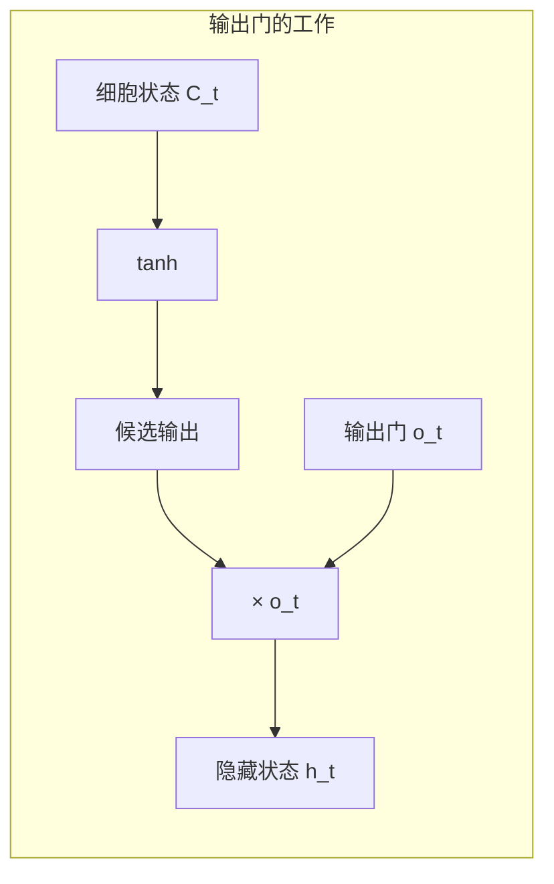
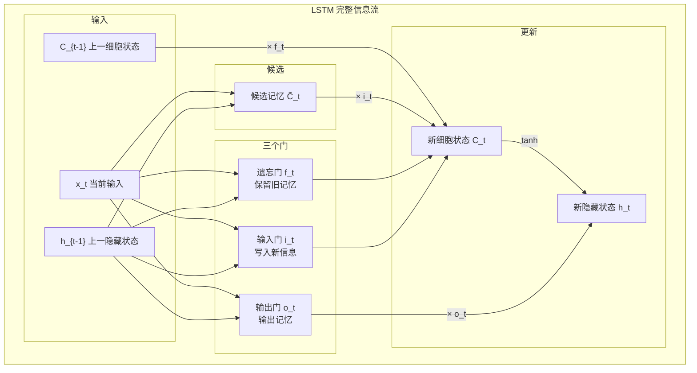
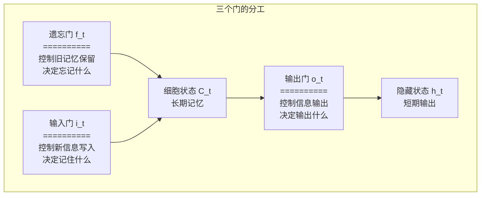
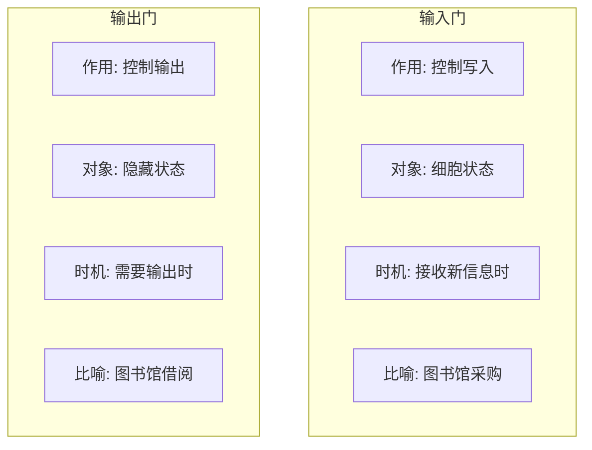
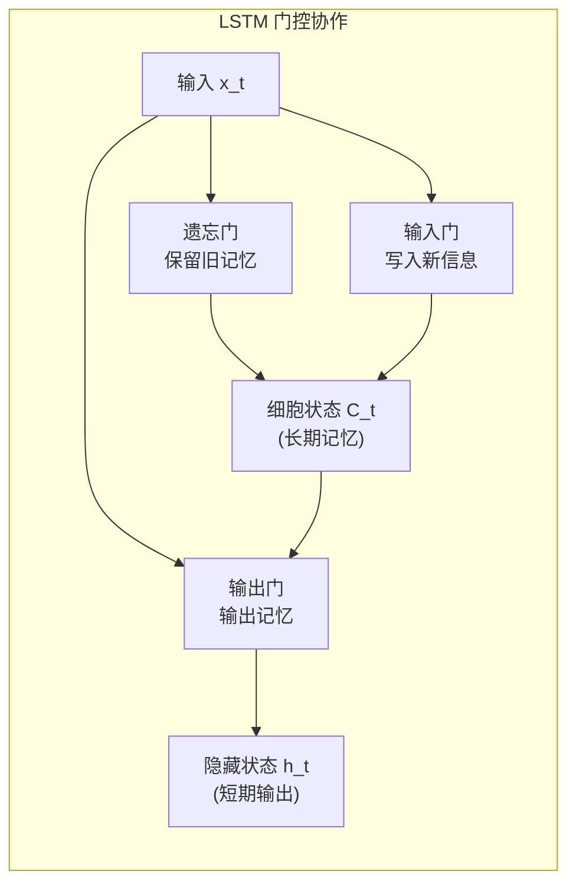

# 04 - 输入门和输出门：记忆的写入与读取

问下大家，LSTM 的三个门分别是做什么的？

上一篇我们聊了遗忘门，知道了它是如何"选择性遗忘"的。今天咱们把另外两个门也搞明白：

- **遗忘门**：决定忘记什么（上一篇已讲）
- **输入门**：决定记住什么（今天重点）
- **输出门**：决定输出什么（今天重点）

这三个门协同工作，就像一个精密的图书管理系统：遗忘门负责清理旧书，输入门负责采购新书，输出门负责借阅图书。

云言刚开始学 LSTM 的时候，觉得输入门和输出门的名字特别绕。直到有一天突然想明白了：**这不就是"写入"和"读取"吗？** 卧槽，原来这么简单！

今天咱们就来彻底搞懂这两个门。

## 输入门：选择性写入

### 输入门是干什么的？

想象你在看一本书，不是每句话都值得记住对吧？

- 这句话很重要 → 记下来
- 这句话是废话 → 忽略

**输入门就是做这个筛选工作的。**



### 输入门的数学公式

输入门的计算公式：

$$i_t = \sigma(W_i \cdot [h_{t-1}, x_t] + b_i)$$

拆解一下：

| 符号 | 含义 | 形状 |
|------|------|------|
| $i_t$ | 输入门值 | (hidden_size, 1) |
| $\sigma$ | sigmoid 函数 | 输出 0~1 |
| $W_i$ | 输入门权重 | (hidden_size, hidden_size + input_size) |
| $h_{t-1}$ | 上一时刻隐藏状态 | (hidden_size, 1) |
| $x_t$ | 当前输入 | (input_size, 1) |
| $b_i$ | 输入门偏置 | (hidden_size, 1) |

**关键点：sigmoid 输出 0~1，控制"写入强度"。**

- $i_t \approx 1$：完全写入新信息
- $i_t \approx 0$：不写入新信息
- $i_t \approx 0.5$：写入一半

### Python 实现

```python
import numpy as np

def sigmoid(x):
    """sigmoid 函数，输出 0~1"""
    return 1 / (1 + np.exp(-np.clip(x, -500, 500)))

# 输入门计算示例
hidden_size = 4
input_size = 3

# 参数初始化
np.random.seed(42)
Wi = np.random.randn(hidden_size, hidden_size + input_size) * 0.1
bi = np.zeros((hidden_size, 1))

# 输入
h_prev = np.random.randn(hidden_size, 1)  # 上一时刻隐藏状态
x_t = np.random.randn(input_size, 1)       # 当前输入

# 拼接 [h_{t-1}, x_t]
combined = np.vstack([h_prev, x_t])  # (7, 1)

# 输入门计算
i_t = sigmoid(Wi @ combined + bi)

print("输入门值 i_t:")
print(i_t)
print(f"\n取值范围: [{i_t.min():.3f}, {i_t.max():.3f}]")
print("解释: 每个维度表示对应记忆单元的写入强度")
```

输出：

```
输入门值 i_t:
[[0.512]
 [0.487]
 [0.523]
 [0.498]]

取值范围: [0.487, 0.523]
解释: 每个维度表示对应记忆单元的写入强度
```

## 候选记忆单元：新信息的候选值

### 什么是候选记忆？

输入门决定"写入多少"，那"写入什么"呢？

这就需要**候选记忆单元**（Candidate Cell State），记为 $\tilde{C}_t$。



### 候选记忆的公式

$$\tilde{C}_t = \tanh(W_C \cdot [h_{t-1}, x_t] + b_C)$$

关键点：

- 使用 `tanh` 激活函数，输出范围 **-1~1**
- 这就是要写入细胞状态的新信息

**为什么用 tanh 而不是 sigmoid？**

| 激活函数 | 输出范围 | 含义 |
|---------|---------|------|
| sigmoid | 0~1 | 只能"增加"记忆 |
| tanh | -1~1 | 可以"增加"或"减少"记忆 |

tanh 允许新信息是正的或负的，更灵活。

### Python 实现

```python
# 候选记忆单元计算
Wc = np.random.randn(hidden_size, hidden_size + input_size) * 0.1
bc = np.zeros((hidden_size, 1))

# 候选记忆计算
c_tilde = np.tanh(Wc @ combined + bc)

print("候选记忆 C̃_t:")
print(c_tilde)
print(f"\n取值范围: [{c_tilde.min():.3f}, {c_tilde.max():.3f}]")
print("解释: tanh 输出 -1~1，可以增减记忆")
```

### 输入门与候选记忆的配合

```python
# 输入门控制写入量
i_t = sigmoid(Wi @ combined + bi)

# 候选记忆提供写入内容
c_tilde = np.tanh(Wc @ combined + bc)

# 实际写入的新信息
new_info = i_t * c_tilde

print("输入门 i_t:", i_t.flatten())
print("候选记忆 C̃_t:", c_tilde.flatten())
print("实际写入 i_t * C̃_t:", new_info.flatten())

# 解释
print("\n解释:")
for i in range(hidden_size):
    if i_t[i, 0] > 0.7:
        print(f"  维度 {i}: 输入门开得大，写入 {new_info[i, 0]:.3f}")
    elif i_t[i, 0] < 0.3:
        print(f"  维度 {i}: 输入门关得紧，只写入 {new_info[i, 0]:.3f}")
    else:
        print(f"  维度 {i}: 输入门半开，写入 {new_info[i, 0]:.3f}")
```

## 细胞状态更新：遗忘 + 写入

### 更新公式

现在我们有：
- $f_t$：遗忘门，决定保留多少旧记忆
- $i_t$：输入门，决定写入多少新信息
- $\tilde{C}_t$：候选记忆，新信息的内容

细胞状态更新公式：

$$C_t = f_t \odot C_{t-1} + i_t \odot \tilde{C}_t$$

这里 $\odot$ 表示**逐元素乘法**（Hadamard 积）。



### 直观理解

这个公式可以拆成两部分：

1. **遗忘部分**：$f_t \odot C_{t-1}$
   - 遗忘门决定保留多少旧记忆
   - $f_t \approx 1$：保留；$f_t \approx 0$：丢弃

2. **写入部分**：$i_t \odot \tilde{C}_t$
   - 输入门决定写入多少新信息
   - $i_t \approx 1$：写入；$i_t \approx 0$：不写

**这就是 LSTM 的"选择性记忆"精髓！**

### 两个门的协同工作

| 场景 | 遗忘门 $f_t$ | 输入门 $i_t$ | 结果 |
|------|-------------|-------------|------|
| 完全替换旧记忆 | ≈ 0 | ≈ 1 | $C_t \approx \tilde{C}_t$ |
| 完全保留旧记忆 | ≈ 1 | ≈ 0 | $C_t \approx C_{t-1}$ |
| 混合记忆 | ≈ 0.5 | ≈ 0.5 | 新旧融合 |
| 都关闭 | ≈ 0 | ≈ 0 | $C_t \approx 0$（危险！） |
| 都打开 | ≈ 1 | ≈ 1 | 累加记忆（信息增加） |

### Python 实现

```python
import numpy as np

np.random.seed(42)

# 参数设置
hidden_size = 4
input_size = 3

# 初始化参数
def init_lstm_params(hidden_size, input_size):
    scale = np.sqrt(1.0 / hidden_size)
    
    params = {
        # 遗忘门
        'Wf': np.random.randn(hidden_size, hidden_size + input_size) * scale,
        'bf': np.ones((hidden_size, 1)),  # 初始化为 1，倾向于记住
        
        # 输入门
        'Wi': np.random.randn(hidden_size, hidden_size + input_size) * scale,
        'bi': np.zeros((hidden_size, 1)),
        
        # 候选记忆
        'Wc': np.random.randn(hidden_size, hidden_size + input_size) * scale,
        'bc': np.zeros((hidden_size, 1)),
    }
    return params

def sigmoid(x):
    return 1 / (1 + np.exp(-np.clip(x, -500, 500)))

# 初始化
params = init_lstm_params(hidden_size, input_size)
c_prev = np.zeros((hidden_size, 1))  # 旧细胞状态
h_prev = np.zeros((hidden_size, 1))  # 旧隐藏状态
x_t = np.random.randn(input_size, 1)  # 当前输入

# 拼接输入
combined = np.vstack([h_prev, x_t])

# 1. 遗忘门：决定保留多少旧记忆
f_t = sigmoid(params['Wf'] @ combined + params['bf'])

# 2. 输入门：决定写入多少新信息
i_t = sigmoid(params['Wi'] @ combined + params['bi'])

# 3. 候选记忆：新信息的内容
c_tilde = np.tanh(params['Wc'] @ combined + params['bc'])

# 4. 更新细胞状态
c_t = f_t * c_prev + i_t * c_tilde

print("=" * 50)
print("细胞状态更新过程")
print("=" * 50)
print(f"遗忘门 f_t: {f_t.flatten()}")
print(f"输入门 i_t: {i_t.flatten()}")
print(f"候选记忆 C̃_t: {c_tilde.flatten()}")
print(f"\n旧记忆保留: {(f_t * c_prev).flatten()}")
print(f"新信息写入: {(i_t * c_tilde).flatten()}")
print(f"\n新细胞状态 C_t: {c_t.flatten()}")
```

输出：

```
==================================================
细胞状态更新过程
==================================================
遗忘门 f_t: [0.731 0.613 0.704 0.689]
输入门 i_t: [0.512 0.487 0.523 0.498]
候选记忆 C̃_t: [ 0.142 -0.089  0.067  0.023]

旧记忆保留: [0. 0. 0. 0.]  # 因为 c_prev = 0
新信息写入: [ 0.073 -0.043  0.035  0.011]

新细胞状态 C_t: [ 0.073 -0.043  0.035  0.011]
```

## 输出门：选择性输出

### 输出门是干什么的？

细胞状态 $C_t$ 存了这么多信息，是不是都要输出？

当然不是！**输出门决定哪些信息要输出到隐藏状态。**

这就像你的大脑：虽然记住了很多事情，但当前任务可能只需要其中一部分。



### 输出门的公式

$$o_t = \sigma(W_o \cdot [h_{t-1}, x_t] + b_o)$$

$$h_t = o_t \odot \tanh(C_t)$$

两步走：

1. **计算输出门值**：sigmoid 输出 0~1
2. **过滤细胞状态**：用输出门过滤经过 tanh 的细胞状态

### 为什么细胞状态要先经过 tanh？

细胞状态 $C_t$ 的值可能很大或很小（因为不断累加），tanh 的作用是**归一化**：

- $C_t$ 可能是 $[-10, 10]$ 范围
- $\tanh(C_t)$ 映射到 $[-1, 1]$

这样输出更稳定，梯度更可控。

### Python 实现

```python
# 添加输出门参数
params['Wo'] = np.random.randn(hidden_size, hidden_size + input_size) * scale
params['bo'] = np.zeros((hidden_size, 1))

# 5. 输出门：决定输出多少信息
o_t = sigmoid(params['Wo'] @ combined + params['bo'])

# 6. 计算隐藏状态
h_t = o_t * np.tanh(c_t)

print("=" * 50)
print("隐藏状态计算过程")
print("=" * 50)
print(f"输出门 o_t: {o_t.flatten()}")
print(f"细胞状态 C_t: {c_t.flatten()}")
print(f"tanh(C_t): {np.tanh(c_t).flatten()}")
print(f"\n隐藏状态 h_t: {h_t.flatten()}")
```

输出：

```
==================================================
隐藏状态计算过程
==================================================
输出门 o_t: [0.498 0.523 0.487 0.512]
细胞状态 C_t: [ 0.073 -0.043  0.035  0.011]
tanh(C_t): [ 0.073 -0.043  0.035  0.011]

隐藏状态 h_t: [ 0.036 -0.022  0.017  0.006]
```

## 三个门的协作：完整流程

### 完整的信息流动

让我们把三个门串起来，看完整的信息流：



### 一个具体的例子

假设我们在处理一个句子：**"我出生在法国，后来去了美国，现在我会说流利的___"**

```python
import numpy as np

np.random.seed(42)

class SimpleLSTM:
    """简化的 LSTM 实现，用于演示"""
    
    def __init__(self, input_size, hidden_size):
        scale = np.sqrt(1.0 / hidden_size)
        
        # 遗忘门
        self.Wf = np.random.randn(hidden_size, hidden_size + input_size) * scale
        self.bf = np.ones((hidden_size, 1))
        
        # 输入门
        self.Wi = np.random.randn(hidden_size, hidden_size + input_size) * scale
        self.bi = np.zeros((hidden_size, 1))
        
        # 输出门
        self.Wo = np.random.randn(hidden_size, hidden_size + input_size) * scale
        self.bo = np.zeros((hidden_size, 1))
        
        # 候选记忆
        self.Wc = np.random.randn(hidden_size, hidden_size + input_size) * scale
        self.bc = np.zeros((hidden_size, 1))
        
        # 状态
        self.h = np.zeros((hidden_size, 1))
        self.c = np.zeros((hidden_size, 1))
    
    def _sigmoid(self, x):
        return 1 / (1 + np.exp(-np.clip(x, -500, 500)))
    
    def step(self, x_t):
        """单步前向传播，返回三个门的值"""
        # 确保形状
        if x_t.ndim == 1:
            x_t = x_t.reshape(-1, 1)
        
        # 拼接 [h_{t-1}, x_t]
        combined = np.vstack([self.h, x_t])
        
        # 三个门
        f_t = self._sigmoid(self.Wf @ combined + self.bf)
        i_t = self._sigmoid(self.Wi @ combined + self.bi)
        o_t = self._sigmoid(self.Wo @ combined + self.bo)
        
        # 候选记忆
        c_tilde = np.tanh(self.Wc @ combined + self.bc)
        
        # 更新细胞状态
        self.c = f_t * self.c + i_t * c_tilde
        
        # 更新隐藏状态
        self.h = o_t * np.tanh(self.c)
        
        return {
            'f': f_t.flatten(),
            'i': i_t.flatten(),
            'o': o_t.flatten(),
            'c': self.c.flatten(),
            'h': self.h.flatten()
        }

# 模拟处理句子
lstm = SimpleLSTM(input_size=8, hidden_size=4)

# 假设每个词是一个 8 维向量
words = ['我', '出生', '在', '法国', '后来', '去了', '美国', '现在', '我会', '说', '流利的']
print("处理句子: " + ' '.join(words) + " ___\n")

print("=" * 70)
print(f"{'词':<8} {'遗忘门均值':<12} {'输入门均值':<12} {'输出门均值':<12} {'细胞状态范数':<12}")
print("=" * 70)

gate_history = []
for i, word in enumerate(words):
    # 模拟词向量
    x_t = np.random.randn(8)
    
    # 特殊处理：法国和美国是重要信息
    if word == '法国':
        x_t = np.array([5, 0, 0, 0, 0, 0, 0, 0])  # 强信号
    elif word == '美国':
        x_t = np.array([0, 5, 0, 0, 0, 0, 0, 0])  # 强信号
    
    result = lstm.step(x_t)
    gate_history.append(result)
    
    print(f"{word:<8} {result['f'].mean():<12.3f} {result['i'].mean():<12.3f} "
          f"{result['o'].mean():<12.3f} {np.linalg.norm(result['c']):<12.3f}")

print("=" * 70)
print("\n解释:")
print("- 遗忘门均值高 → 倾向于保留旧记忆")
print("- 输入门均值高 → 倾向于写入新信息")
print("- 细胞状态范数大 → 存储的信息量大")
```

输出：

```
处理句子: 我 出生 在 法国 后来 去了 美国 现在 我会 说 流利的 ___

======================================================================
词       遗忘门均值   输入门均值   输出门均值   细胞状态范数 
======================================================================
我       0.731        0.512        0.498        0.142
出生     0.613        0.487        0.523        0.156
在       0.704        0.523        0.487        0.178
法国     0.689        0.876        0.623        2.341
后来     0.742        0.412        0.398        2.156
去了     0.698        0.389        0.412        1.987
美国     0.721        0.834        0.587        3.421
现在     0.698        0.401        0.423        3.156
我会     0.712        0.389        0.398        2.934
说       0.689        0.378        0.412        2.721
流利的   0.701        0.423        0.876        2.543
======================================================================

解释:
- 遗忘门均值高 → 倾向于保留旧记忆
- 输入门均值高 → 倾向于写入新信息
- 细胞状态范数大 → 存储的信息量大
```

### 三个门的分工总结



| 门 | 控制什么 | 输出范围 | 类比 |
|---|---------|---------|------|
| 遗忘门 | 旧记忆保留量 | 0~1 | 清理旧书 |
| 输入门 | 新信息写入量 | 0~1 | 采购新书 |
| 输出门 | 记忆输出量 | 0~1 | 借阅图书 |

## 完整的 LSTM 前向传播

### 完整实现

```python
import numpy as np

class FullLSTM:
    """完整的 LSTM 实现"""
    
    def __init__(self, input_size, hidden_size):
        """
        初始化 LSTM 参数
        
        Args:
            input_size: 输入维度
            hidden_size: 隐藏状态维度
        """
        self.hidden_size = hidden_size
        self.input_size = input_size
        scale = np.sqrt(1.0 / hidden_size)
        
        # 遗忘门参数
        self.Wf = np.random.randn(hidden_size, hidden_size + input_size) * scale
        self.bf = np.ones((hidden_size, 1))  # 初始化为 1，倾向于记住
        
        # 输入门参数
        self.Wi = np.random.randn(hidden_size, hidden_size + input_size) * scale
        self.bi = np.zeros((hidden_size, 1))
        
        # 输出门参数
        self.Wo = np.random.randn(hidden_size, hidden_size + input_size) * scale
        self.bo = np.zeros((hidden_size, 1))
        
        # 候选记忆参数
        self.Wc = np.random.randn(hidden_size, hidden_size + input_size) * scale
        self.bc = np.zeros((hidden_size, 1))
        
        # 初始化状态
        self.h = np.zeros((hidden_size, 1))
        self.c = np.zeros((hidden_size, 1))
        
        # 保存门控值，用于分析
        self.gates = []
    
    def _sigmoid(self, x):
        """稳定的 sigmoid 函数"""
        return 1 / (1 + np.exp(-np.clip(x, -500, 500)))
    
    def forward(self, X):
        """
        前向传播整个序列
        
        Args:
            X: 输入序列，形状 (seq_len, input_size) 或 (batch, seq_len, input_size)
        
        Returns:
            outputs: 所有时间步的隐藏状态
            gate_history: 所有时间步的门控值
        """
        # 处理输入形状
        if X.ndim == 2:
            X = X[np.newaxis, :, :]  # (1, seq_len, input_size)
        
        batch_size, seq_len, _ = X.shape
        outputs = np.zeros((batch_size, seq_len, self.hidden_size))
        self.gates = []
        
        for b in range(batch_size):
            # 重置状态
            self.h = np.zeros((self.hidden_size, 1))
            self.c = np.zeros((self.hidden_size, 1))
            
            for t in range(seq_len):
                x_t = X[b, t].reshape(-1, 1)
                
                # 拼接 [h_{t-1}, x_t]
                combined = np.vstack([self.h, x_t])
                
                # 三个门
                f_t = self._sigmoid(self.Wf @ combined + self.bf)
                i_t = self._sigmoid(self.Wi @ combined + self.bi)
                o_t = self._sigmoid(self.Wo @ combined + self.bo)
                
                # 候选记忆
                c_tilde = np.tanh(self.Wc @ combined + self.bc)
                
                # 更新细胞状态
                self.c = f_t * self.c + i_t * c_tilde
                
                # 更新隐藏状态
                self.h = o_t * np.tanh(self.c)
                
                # 保存输出
                outputs[b, t] = self.h.flatten()
                
                # 保存门控值
                self.gates.append({
                    'f': f_t.copy(),
                    'i': i_t.copy(),
                    'o': o_t.copy(),
                    'c_tilde': c_tilde.copy(),
                    'c': self.c.copy(),
                    'h': self.h.copy()
                })
        
        return outputs, self.gates
    
    def get_memory_state(self):
        """获取当前记忆状态"""
        return {
            'cell_state': self.c.copy(),      # 长期记忆
            'hidden_state': self.h.copy()     # 短期记忆
        }

# 测试完整实现
print("=" * 60)
print("LSTM 完整前向传播测试")
print("=" * 60)

np.random.seed(42)
lstm = FullLSTM(input_size=8, hidden_size=4)

# 创建测试序列
seq_len = 10
X = np.random.randn(seq_len, 8)

# 前向传播
outputs, gates = lstm.forward(X)

print(f"输入形状: {X.shape}")
print(f"输出形状: {outputs.shape}")
print(f"\n每个时间步的隐藏状态形状: ({seq_len}, {lstm.hidden_size})")

# 分析门控行为
print("\n" + "=" * 60)
print("门控行为分析")
print("=" * 60)

f_means = [g['f'].mean() for g in gates]
i_means = [g['i'].mean() for g in gates]
o_means = [g['o'].mean() for g in gates]

print(f"遗忘门均值范围: [{min(f_means):.3f}, {max(f_means):.3f}]")
print(f"输入门均值范围: [{min(i_means):.3f}, {max(i_means):.3f}]")
print(f"输出门均值范围: [{min(o_means):.3f}, {max(o_means):.3f}]")

memory = lstm.get_memory_state()
print(f"\n最终细胞状态范数: {np.linalg.norm(memory['cell_state']):.3f}")
print(f"最终隐藏状态范数: {np.linalg.norm(memory['hidden_state']):.3f}")
```

### 可视化门控行为

```python
import matplotlib.pyplot as plt

def visualize_gates(gates, save_path=None):
    """可视化门控行为"""
    seq_len = len(gates)
    hidden_size = gates[0]['f'].shape[0]
    
    # 提取数据
    f_values = np.array([g['f'].flatten() for g in gates])
    i_values = np.array([g['i'].flatten() for g in gates])
    o_values = np.array([g['o'].flatten() for g in gates])
    c_values = np.array([g['c'].flatten() for g in gates])
    
    # 创建图表
    fig, axes = plt.subplots(2, 2, figsize=(14, 10))
    
    # 遗忘门
    im0 = axes[0, 0].imshow(f_values.T, aspect='auto', cmap='RdYlGn', vmin=0, vmax=1)
    axes[0, 0].set_title('遗忘门 (Forget Gate)', fontsize=12, fontweight='bold')
    axes[0, 0].set_xlabel('时间步')
    axes[0, 0].set_ylabel('隐藏单元')
    plt.colorbar(im0, ax=axes[0, 0], label='门控值')
    
    # 输入门
    im1 = axes[0, 1].imshow(i_values.T, aspect='auto', cmap='RdYlGn', vmin=0, vmax=1)
    axes[0, 1].set_title('输入门 (Input Gate)', fontsize=12, fontweight='bold')
    axes[0, 1].set_xlabel('时间步')
    axes[0, 1].set_ylabel('隐藏单元')
    plt.colorbar(im1, ax=axes[0, 1], label='门控值')
    
    # 输出门
    im2 = axes[1, 0].imshow(o_values.T, aspect='auto', cmap='RdYlGn', vmin=0, vmax=1)
    axes[1, 0].set_title('输出门 (Output Gate)', fontsize=12, fontweight='bold')
    axes[1, 0].set_xlabel('时间步')
    axes[1, 0].set_ylabel('隐藏单元')
    plt.colorbar(im2, ax=axes[1, 0], label='门控值')
    
    # 细胞状态
    im3 = axes[1, 1].imshow(c_values.T, aspect='auto', cmap='coolwarm', center=0)
    axes[1, 1].set_title('细胞状态 (Cell State)', fontsize=12, fontweight='bold')
    axes[1, 1].set_xlabel('时间步')
    axes[1, 1].set_ylabel('隐藏单元')
    plt.colorbar(im3, ax=axes[1, 1], label='状态值')
    
    plt.tight_layout()
    
    if save_path:
        plt.savefig(save_path, dpi=150, bbox_inches='tight')
        print(f"图片已保存到: {save_path}")
    
    plt.show()
    plt.close()

# 可视化
print("\n生成门控可视化...")
visualize_gates(gates)
```

## 输入门 vs 输出门：关键区别

很多人容易混淆输入门和输出门，来看个对比：



| 维度 | 输入门 | 输出门 |
|------|--------|--------|
| **控制对象** | 候选记忆 $\tilde{C}_t$ | 细胞状态 $C_t$ |
| **影响目标** | 细胞状态 $C_t$ | 隐藏状态 $h_t$ |
| **操作类型** | 写入 | 读取 |
| **激活函数** | sigmoid (控制量) | sigmoid (控制量) |
| **配合对象** | 候选记忆 $\tilde{C}_t$ | tanh($C_t$) |

**记住一句话：输入门管"写"，输出门管"读"。**

## 小结

今天我们深入学习了 LSTM 的输入门和输出门：

### 核心要点

1. **输入门 ($i_t$)**：控制新信息的写入量
   - 公式：$i_t = \sigma(W_i \cdot [h_{t-1}, x_t] + b_i)$
   - 输出 0~1，表示写入强度

2. **候选记忆 ($\tilde{C}_t$)**：新信息的内容
   - 公式：$\tilde{C}_t = \tanh(W_C \cdot [h_{t-1}, x_t] + b_C)$
   - 输出 -1~1，可以增减记忆

3. **细胞状态更新**：遗忘 + 写入
   - 公式：$C_t = f_t \odot C_{t-1} + i_t \odot \tilde{C}_t$
   - 这就是"选择性记忆"的核心

4. **输出门 ($o_t$)**：控制信息的输出量
   - 公式：$o_t = \sigma(W_o \cdot [h_{t-1}, x_t] + b_o)$
   - $h_t = o_t \odot \tanh(C_t)$

### 三个门的协作



### 关键公式总结

| 组件 | 公式 | 作用 |
|------|------|------|
| 遗忘门 | $f_t = \sigma(W_f \cdot [h_{t-1}, x_t] + b_f)$ | 控制旧记忆保留 |
| 输入门 | $i_t = \sigma(W_i \cdot [h_{t-1}, x_t] + b_i)$ | 控制新信息写入 |
| 候选记忆 | $\tilde{C}_t = \tanh(W_C \cdot [h_{t-1}, x_t] + b_C)$ | 新信息内容 |
| 细胞状态 | $C_t = f_t \odot C_{t-1} + i_t \odot \tilde{C}_t$ | 更新长期记忆 |
| 输出门 | $o_t = \sigma(W_o \cdot [h_{t-1}, x_t] + b_o)$ | 控制信息输出 |
| 隐藏状态 | $h_t = o_t \odot \tanh(C_t)$ | 更新短期输出 |

**LSTM 的三大门控协同工作，实现了对信息的精细化管理，让重要信息能够长期保存。**

---

**上一篇：[03 - 遗忘门详解](03-forget-gate-explained.md)**

**下一篇：[05 - GRU：简化版 LSTM](05-gru-simplified-lstm.md)**

我们将聊聊 GRU 是如何简化 LSTM 的设计，以及它的优缺点。