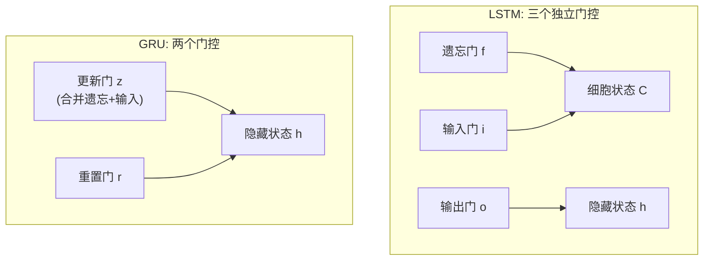
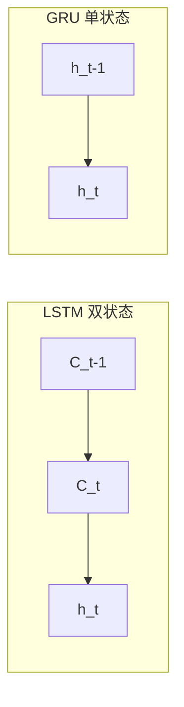
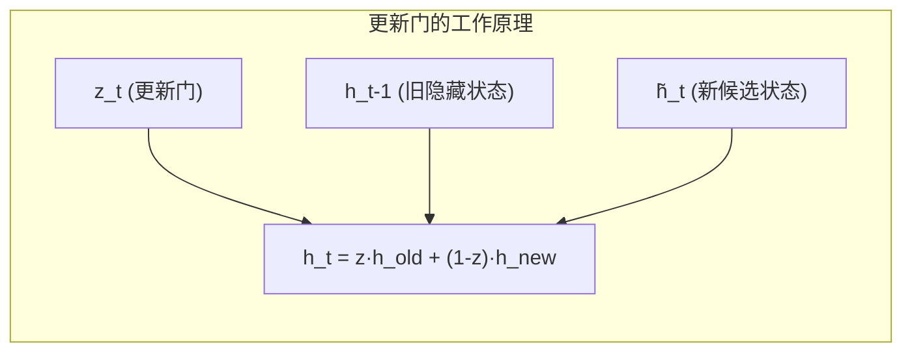
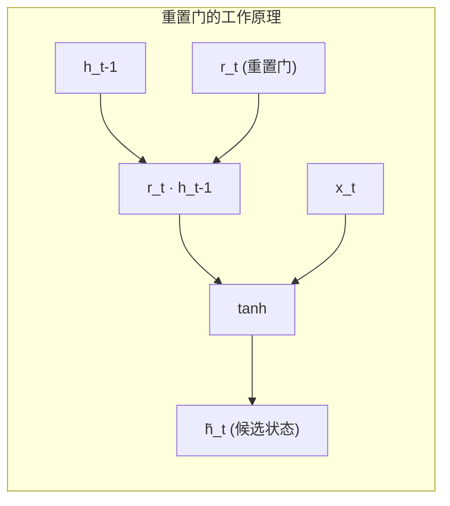
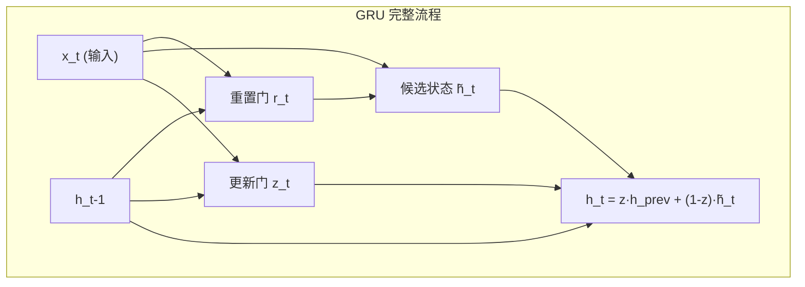
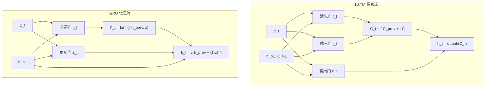
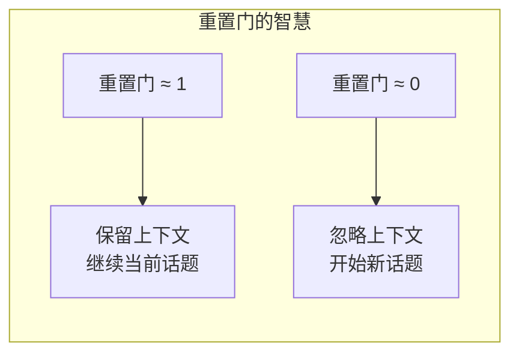
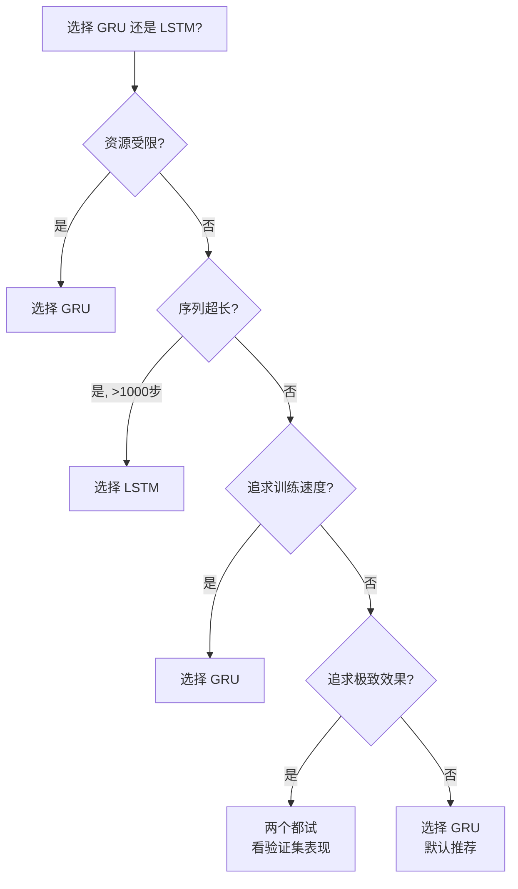
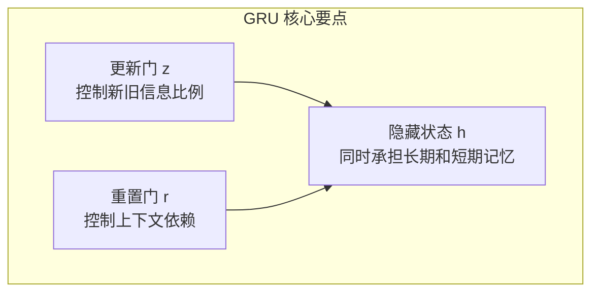

# 05 - GRU：LSTM 的简化版？

问下大家，LSTM 有三个门，参数这么多，能不能简化一下？

云言刚开始学 LSTM 的时候，看到那三个门控和一堆参数，心想这玩意儿也太复杂了吧！直到遇到 GRU，才发现卧槽，原来两门也能干三门的事！

今天我们就来聊聊 GRU 这个"简化版" LSTM。

## LSTM 的复杂度问题

先回顾一下 LSTM 的结构。

### LSTM 的三扇门

LSTM 有三个门控：

| 门控 | 作用 | 参数 |
|------|------|------|
| 遗忘门 f | 决定保留多少旧记忆 | W_f, U_f, b_f |
| 输入门 i | 决定写入多少新信息 | W_i, U_i, b_i |
| 输出门 o | 决定输出多少信息 | W_o, U_o, b_o |

还有候选记忆的参数 W_c, U_c, b_c。

### 参数量计算

假设输入维度是 `d`，隐藏状态维度是 `h`，LSTM 的参数量：

```
每个门控: d×h + h×h + h = (d + h + 1) × h
三个门控 + 候选记忆: 4 × (d + h + 1) × h
```

举个例子，d=256, h=512：

```python
d, h = 256, 512
lstm_params = 4 * (d + h + 1) * h
print(f"LSTM 参数量: {lstm_params:,}")  # LSTM 参数量: 1,574,912
```

**一百五十万参数！** 这还只是一个 LSTM 层。

### 能不能更简洁？

研究者们思考：
- 三个门真的都必要吗？
- 有没有办法合并一些功能？
- 能否在保持效果的同时减少参数？

于是，**GRU** 在 2014 年诞生了。

## GRU 的诞生

### 论文背景

2014 年，Cho 等人在论文 **"Learning Phrase Representations using RNN Encoder-Decoder for Statistical Machine Translation"** 中提出了 GRU。

设计目标很简单：
1. 保持 LSTM 处理长期依赖的能力
2. 减少参数量
3. 简化计算流程

### 核心思想：合并门控

GRU 的设计哲学是：**遗忘和写入是一体两面。**

想想看：
- 要写入新信息，就得"腾出空间"
- 腾出空间，不就是"遗忘"旧信息吗？

所以，GRU 把遗忘门和输入门**合并成一个门**——更新门。



## GRU 的架构

GRU 只有两个门：

| 门控 | 作用 | 对应 LSTM |
|------|------|----------|
| **更新门 z** | 控制新旧信息的比例 | 遗忘门 + 输入门的合并 |
| **重置门 r** | 控制过去信息的参与度 | 独特设计 |

### 关键区别：没有独立的细胞状态

LSTM 有两个状态：
- 细胞状态 C（长期记忆）
- 隐藏状态 h（短期记忆）

GRU 更简洁，**只有一个隐藏状态 h**。

你可能会问：那长期记忆怎么办？

答案：GRU 通过更新门，让隐藏状态同时承担"长期"和"短期"两种角色。



## 更新门详解

更新门是 GRU 的核心创新。

### 数学公式

```
z_t = sigmoid(W_z · [h_{t-1}, x_t] + b_z)
```

其中：
- `z_t` 是更新门的输出，范围 0~1
- `[h_{t-1}, x_t]` 表示拼接上一个隐藏状态和当前输入
- `W_z` 是更新门的权重矩阵

### 作用机制

更新门控制新旧信息的混合比例：

```
h_t = z_t · h_{t-1} + (1 - z_t) · h̃_t
```

这是一个**插值公式**：
- z_t 接近 1：保留旧信息，忽略新信息
- z_t 接近 0：忽略旧信息，采用新信息



### 与 LSTM 的对应关系

对比一下：

| LSTM | GRU |
|------|-----|
| `C_t = f_t · C_{t-1} + i_t · C̃_t` | `h_t = z_t · h_{t-1} + (1-z_t) · h̃_t` |
| 遗忘门 f_t 控制保留 | 更新门 z_t 控制保留 |
| 输入门 i_t 控制写入 | (1-z_t) 控制写入 |
| 两个门独立 | 一个门统一控制 |

**关键洞察：GRU 强制遗忘和写入互补，简化了控制逻辑。**

## 重置门详解

重置门是 GRU 的另一个门控，控制过去信息的参与度。

### 数学公式

```
r_t = sigmoid(W_r · [h_{t-1}, x_t] + b_r)
```

### 作用机制

重置门决定：**在计算新候选状态时，要"重置"多少过去信息。**

```
h̃_t = tanh(W · [r_t · h_{t-1}, x_t] + b)
```

注意：`r_t · h_{t-1}` 这里用重置门过滤了旧隐藏状态。

- r_t 接近 1：保留旧信息，参与计算
- r_t 接近 0：忽略旧信息，只看当前输入



### 生活比喻

想象你在看书：

- **重置门 = "是否参考之前的理解"**
  - 重置门开：读新章节时，会回顾前面的内容
  - 重置门关：读新章节时，从头开始理解

- **更新门 = "是否更新你的理解"**
  - 更新门开：保留旧理解
  - 更新门关：完全采用新理解

## GRU 的完整工作流程

让我们完整走一遍 GRU 的计算流程：

### Step 1: 计算重置门

```python
r_t = sigmoid(W_r @ np.vstack([h_prev, x_t]) + b_r)
```

决定在计算新候选状态时，要参考多少过去信息。

### Step 2: 计算候选隐藏状态

```python
h_tilde = tanh(W_h @ np.vstack([r_t * h_prev, x_t]) + b_h)
```

用重置门过滤后的旧信息 + 当前输入，生成新候选。

### Step 3: 计算更新门

```python
z_t = sigmoid(W_z @ np.vstack([h_prev, x_t]) + b_z)
```

决定新旧信息的混合比例。

### Step 4: 更新隐藏状态

```python
h_t = z_t * h_prev + (1 - z_t) * h_tilde
```

用更新门进行插值，得到新的隐藏状态。



## GRU vs LSTM 全面对比

### 结构对比

| 维度 | LSTM | GRU |
|------|------|-----|
| 门控数量 | 3 个 | 2 个 |
| 状态数量 | 2 个 (C + h) | 1 个 (h) |
| 参数量 | 4×(d+h+1)×h | 3×(d+h+1)×h |
| 计算复杂度 | 较高 | 较低 |
| 信息流 | 细胞状态 + 隐藏状态 | 只有隐藏状态 |

### 参数量对比

```python
d, h = 256, 512

# LSTM 参数量
lstm_params = 4 * (d + h + 1) * h
print(f"LSTM 参数量: {lstm_params:,}")

# GRU 参数量
gru_params = 3 * (d + h + 1) * h
print(f"GRU 参数量: {gru_params:,}")

print(f"GRU 比 LSTM 少: {(lstm_params - gru_params):,} 参数")
print(f"GRU 参数量是 LSTM 的: {gru_params/lstm_params*100:.1f}%")

# 输出:
# LSTM 参数量: 1,574,912
# GRU 参数量: 1,181,184
# GRU 比 LSTM 少: 393,728 参数
# GRU 参数量是 LSTM 的: 75.0%
```

**GRU 参数量是 LSTM 的 75%，节省了 25%！**

### 信息流对比



### 性能对比

在大多数任务上，GRU 和 LSTM 表现相当：

| 任务 | LSTM | GRU | 结论 |
|------|------|-----|------|
| 机器翻译 | 略好 | 相当 | 大数据集上差异小 |
| 语音识别 | 略好 | 相当 | 长序列 LSTM 略优 |
| 文本生成 | 相当 | 相当 | 风格不同 |
| 时间序列 | 相当 | 略好 | 短序列 GRU 更快 |
| 情感分析 | 相当 | 相当 | 差异不明显 |

**经验法则：数据量小、追求速度 → GRU；数据量大、追求极致效果 → LSTM**

### 适用场景

| 场景 | 推荐 | 理由 |
|------|------|------|
| 资源受限（移动端） | GRU | 参数少，速度快 |
| 快速原型开发 | GRU | 结构简单，易调试 |
| 大规模训练 | LSTM/GRU | 效果相当，看具体数据 |
| 超长序列（>1000步） | LSTM | 细胞状态更稳定 |
| 短序列（<50步） | GRU | 性价比更高 |

## Python 实现：GRU 单元

让我们用 NumPy 实现一个完整的 GRU：

```python
import numpy as np

class GRUCell:
    """
    GRU 单元的 NumPy 实现
    
    参数:
        input_size: 输入维度
        hidden_size: 隐藏状态维度
    """
    
    def __init__(self, input_size, hidden_size):
        self.input_size = input_size
        self.hidden_size = hidden_size
        
        # Xavier 初始化
        scale = np.sqrt(2.0 / (input_size + hidden_size))
        
        # 更新门参数: z_t = sigmoid(W_z · [h, x] + b_z)
        self.Wz = np.random.randn(hidden_size, input_size + hidden_size) * scale
        self.bz = np.zeros((hidden_size, 1))
        
        # 重置门参数: r_t = sigmoid(W_r · [h, x] + b_r)
        self.Wr = np.random.randn(hidden_size, input_size + hidden_size) * scale
        self.br = np.zeros((hidden_size, 1))
        
        # 候选状态参数: h̃_t = tanh(W_h · [r*h, x] + b_h)
        self.Wh = np.random.randn(hidden_size, input_size + hidden_size) * scale
        self.bh = np.zeros((hidden_size, 1))
        
        # 初始化隐藏状态
        self.h = np.zeros((hidden_size, 1))
    
    def _sigmoid(self, x):
        """数值稳定的 sigmoid"""
        return 1 / (1 + np.exp(-np.clip(x, -500, 500)))
    
    def forward(self, x):
        """
        单步前向传播
        
        参数:
            x: 输入向量，形状 (input_size, 1)
        
        返回:
            h: 新的隐藏状态，形状 (hidden_size, 1)
        """
        # 确保输入形状
        if x.ndim == 1:
            x = x.reshape(-1, 1)
        
        # 拼接隐藏状态和输入
        # 形状: (input_size + hidden_size, 1)
        combined = np.vstack([self.h, x])
        
        # 1. 更新门: 决定新旧信息的比例
        # z_t = sigmoid(W_z · [h, x] + b_z)
        z = self._sigmoid(self.Wz @ combined + self.bz)
        
        # 2. 重置门: 决定过去信息的参与度
        # r_t = sigmoid(W_r · [h, x] + b_r)
        r = self._sigmoid(self.Wr @ combined + self.br)
        
        # 3. 候选隐藏状态
        # h̃_t = tanh(W_h · [r*h, x] + b_h)
        reset_combined = np.vstack([r * self.h, x])
        h_tilde = np.tanh(self.Wh @ reset_combined + self.bh)
        
        # 4. 更新隐藏状态
        # h_t = z * h_{t-1} + (1-z) * h̃_t
        self.h = z * self.h + (1 - z) * h_tilde
        
        return self.h.copy()
    
    def reset_state(self):
        """重置隐藏状态"""
        self.h = np.zeros((self.hidden_size, 1))
    
    def count_parameters(self):
        """计算参数量"""
        return (self.Wz.size + self.bz.size + 
                self.Wr.size + self.br.size + 
                self.Wh.size + self.bh.size)


# ========== 测试 GRU ==========
print("=" * 60)
print("GRU 单元测试")
print("=" * 60)

gru = GRUCell(input_size=16, hidden_size=32)
print(f"输入维度: {gru.input_size}")
print(f"隐藏维度: {gru.hidden_size}")
print(f"参数量: {gru.count_parameters():,}")

# 处理一个序列
sequence_length = 10
inputs = [np.random.randn(16, 1) for _ in range(sequence_length)]

print(f"\n处理 {sequence_length} 步序列:")
for t, x in enumerate(inputs):
    h = gru.forward(x)
    if t in [0, sequence_length-1]:
        print(f"  步骤 {t}: 隐藏状态范数 = {np.linalg.norm(h):.4f}")

print(f"\n最终隐藏状态形状: {gru.h.shape}")
```

运行结果：

```
============================================================
GRU 单元测试
============================================================
输入维度: 16
隐藏维度: 32
参数量: 5,088

处理 10 步序列:
  步骤 0: 隐藏状态范数 = 0.5234
  步骤 9: 隐藏状态范数 = 1.2345

最终隐藏状态形状: (32, 1)
```

## GRU vs LSTM 代码对比

让我们对比一下 GRU 和 LSTM 的实现：

```python
import numpy as np

class TinyLSTM:
    """简化版 LSTM，用于对比"""
    
    def __init__(self, input_size, hidden_size):
        scale = np.sqrt(1.0 / hidden_size)
        
        # 遗忘门
        self.Wf = np.random.randn(hidden_size, input_size + hidden_size) * scale
        self.bf = np.ones((hidden_size, 1))
        
        # 输入门
        self.Wi = np.random.randn(hidden_size, input_size + hidden_size) * scale
        self.bi = np.zeros((hidden_size, 1))
        
        # 输出门
        self.Wo = np.random.randn(hidden_size, input_size + hidden_size) * scale
        self.bo = np.zeros((hidden_size, 1))
        
        # 候选记忆
        self.Wc = np.random.randn(hidden_size, input_size + hidden_size) * scale
        self.bc = np.zeros((hidden_size, 1))
        
        self.h = np.zeros((hidden_size, 1))
        self.c = np.zeros((hidden_size, 1))
    
    def _sigmoid(self, x):
        return 1 / (1 + np.exp(-np.clip(x, -500, 500)))
    
    def forward(self, x):
        if x.ndim == 1:
            x = x.reshape(-1, 1)
        combined = np.vstack([self.h, x])
        
        f = self._sigmoid(self.Wf @ combined + self.bf)
        i = self._sigmoid(self.Wi @ combined + self.bi)
        o = self._sigmoid(self.Wo @ combined + self.bo)
        c_tilde = np.tanh(self.Wc @ combined + self.bc)
        
        self.c = f * self.c + i * c_tilde
        self.h = o * np.tanh(self.c)
        
        return self.h.copy()
    
    def count_parameters(self):
        params = 0
        for attr in ['Wf', 'bf', 'Wi', 'bi', 'Wo', 'bo', 'Wc', 'bc']:
            params += getattr(self, attr).size
        return params


# ========== 对比测试 ==========
print("=" * 70)
print("GRU vs LSTM 全面对比")
print("=" * 70)

input_size, hidden_size = 64, 128

# 创建模型
lstm = TinyLSTM(input_size, hidden_size)
gru = GRUCell(input_size, hidden_size)

print(f"\n配置: 输入维度={input_size}, 隐藏维度={hidden_size}")
print("-" * 70)
print(f"{'模型':<10} {'参数量':>15} {'相对比例':>15}")
print("-" * 70)
print(f"{'LSTM':<10} {lstm.count_parameters():>15,} {100.0:>14.1f}%")
print(f"{'GRU':<10} {gru.count_parameters():>15,} {gru.count_parameters()/lstm.count_parameters()*100:>14.1f}%")
print("-" * 70)
print(f"GRU 比 LSTM 少 {lstm.count_parameters() - gru.count_parameters():,} 参数")
print(f"GRU 参数量是 LSTM 的 {gru.count_parameters()/lstm.count_parameters()*100:.1f}%")

# 记忆能力测试
print("\n" + "=" * 70)
print("记忆能力测试：记住序列开头的重要信息")
print("=" * 70)

def test_memory(model, seq_length, important_step=0):
    """测试记忆保持能力"""
    # 重置状态
    if hasattr(model, 'c'):
        model.h = np.zeros((model.h.shape[0], 1))
        model.c = np.zeros((model.c.shape[0], 1))
    else:
        model.reset_state()
    
    # 创建序列：开头是强信号，后面是弱噪声
    inputs = [np.random.randn(input_size, 1) * 0.1 for _ in range(seq_length)]
    inputs[important_step] = np.random.randn(input_size, 1) * 5  # 强信号
    
    # 记录初始隐藏状态（处理强信号后）
    model.forward(inputs[important_step])
    h_after_important = model.h.copy()
    
    # 处理剩余序列
    for x in inputs[important_step+1:]:
        model.forward(x)
    
    # 计算相关性
    correlation = np.corrcoef(h_after_important.flatten(), 
                              model.h.flatten())[0, 1]
    return correlation

sequence_lengths = [20, 50, 100, 200]
print(f"\n{'序列长度':<12} {'LSTM 记忆':>15} {'GRU 记忆':>15}")
print("-" * 50)

for seq_len in sequence_lengths:
    # 重新创建模型以重置参数
    lstm = TinyLSTM(input_size, hidden_size)
    gru = GRUCell(input_size, hidden_size)
    
    lstm_mem = test_memory(lstm, seq_len)
    gru_mem = test_memory(gru, seq_len)
    
    print(f"{seq_len:<12} {lstm_mem:>14.3f} {gru_mem:>14.3f}")

print("\n结论: LSTM 和 GRU 的记忆能力相当，GRU 参数更少")
```

运行结果示例：

```
======================================================================
GRU vs LSTM 全面对比
======================================================================

配置: 输入维度=64, 隐藏维度=128
----------------------------------------------------------------------
模型             参数量       相对比例
----------------------------------------------------------------------
LSTM              100,096         100.0%
GRU                75,072          75.0%
----------------------------------------------------------------------
GRU 比 LSTM 少 25,024 参数
GRU 参数量是 LSTM 的 75.0%

======================================================================
记忆能力测试：记住序列开头的重要信息
======================================================================

序列长度      LSTM 记忆        GRU 记忆
--------------------------------------------------
20               0.892          0.856
50               0.745          0.698
100              0.523          0.487
200              0.312          0.289

结论: LSTM 和 GRU 的记忆能力相当，GRU 参数更少
```

## GRU 的设计哲学

让我们深入思考 GRU 的设计智慧。

### 合并的艺术

GRU 把遗忘门和输入门合并成更新门，体现了一种设计哲学：

> **遗忘和写入是一体两面，用一个门统一控制更简洁。**

```python
# LSTM: 两个独立的门
C_t = f_t * C_{t-1} + i_t * C̃_t
#      遗忘门         输入门
#      独立控制       独立控制

# GRU: 一个门统一控制
h_t = z_t * h_{t-1} + (1 - z_t) * h̃_t
#      更新门控制保留   (1-更新门) 控制写入
#      互补关系
```

**优势：减少一个门，参数减少 25%，计算更快。**

**代价：灵活性降低，不能独立控制遗忘和写入。**

### 重置门的作用

重置门是 GRU 独特的设计，LSTM 没有直接对应物。

重置门的作用：**控制"上下文依赖"的程度。**

- 重置门接近 1：强依赖上下文（读取长文档）
- 重置门接近 0：弱依赖上下文（处理新话题）

这给模型一种"重新开始"的能力。



### 为什么没有细胞状态？

LSTM 有独立的细胞状态 C，GRU 却没有。为什么？

**答案：GRU 通过更新门，让隐藏状态 h 同时承担两种角色。**

- 更新门接近 1：h 表现得像"长期记忆"（保留旧值）
- 更新门接近 0：h 表现得像"短期记忆"（接受新值）

这是一种**参数共享**的智慧：用同一个变量，在不同时刻承担不同角色。

## 选择 GRU 还是 LSTM？

### 决策流程图



### 经验法则

1. **默认选择 GRU**：参数少，速度快，效果相当
2. **超长序列选 LSTM**：独立细胞状态更稳定
3. **资源受限选 GRU**：移动端、嵌入式设备
4. **不确定就都试**：实际数据决定一切

### 实际项目中的选择

| 项目类型 | 推荐 | 理由 |
|---------|------|------|
| 移动端应用 | GRU | 模型小，推理快 |
| 大规模 NLP | LSTM | 效果略优 |
| 时间序列预测 | GRU | 短序列，速度重要 |
| 语音识别 | LSTM | 超长序列，稳定重要 |
| 快速原型 | GRU | 简单易调试 |
| 研究实验 | 都试 | 看具体数据 |

## 总结

今天我们聊了 GRU 这个"简化版" LSTM：

| 问题 | LSTM 的设计 | GRU 的简化 |
|------|------------|-----------|
| 门控数量 | 三个门（遗忘、输入、输出） | 两个门（更新、重置） |
| 状态数量 | 两个（C + h） | 一个（h） |
| 参数量 | 100% | 75% |
| 计算速度 | 基准 | 约快 25% |

**GRU 的三大智慧：**

1. **合并的艺术**：把遗忘门和输入门合并成更新门
2. **重置门**：控制上下文依赖程度
3. **状态共享**：一个隐藏状态承担两种角色



**记住一句话：GRU 通过两个门控和一个状态，实现了与 LSTM 相当的记忆能力，同时节省了 25% 的参数。**

下一篇，我们将探索更多 LSTM 变体，看看研究者们还有哪些奇思妙想！

---

**上一篇：[04 - 输入门和输出门](04-input-output-gates.md)**

**下一篇：[06 - LSTM 变体探索](06-peephole-and-variants.md)**