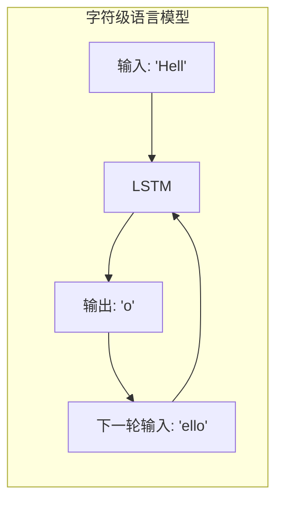
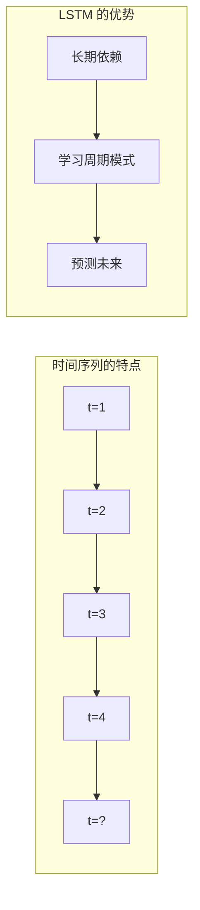
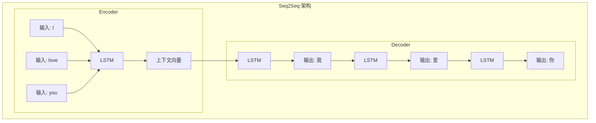
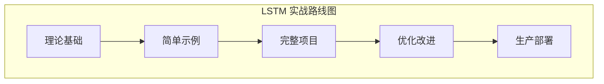

# 07 - LSTM 实战应用：从理论到代码

问下大家，学会了 LSTM 的原理，怎么用到实际项目中？

云言刚开始学 LSTM 的时候，把门控机制背得滚瓜烂熟，三个门怎么工作、梯度怎么流动，说得头头是道。但真要上手写个项目，才发现卧槽，原来从理论到实践还有这么多坑！

今天我们就来聊聊 LSTM 的实战应用，把那些课本上学不到的东西一次性讲透。

## 文本生成：LSTM 的经典战场

文本生成是 LSTM 最经典的应用场景。为什么？因为语言本身就是一个序列，每个词都和前面的词紧密相关。

### 字符级语言模型

最简单的文本生成是**字符级语言模型**：一个字符一个字符地生成文本。



来看个完整示例：

```python
import numpy as np

class CharLSTM:
    """字符级 LSTM 语言模型"""
    
    def __init__(self, vocab_size, hidden_size):
        """
        初始化字符级 LSTM
        
        Args:
            vocab_size: 词汇表大小（字符种类数）
            hidden_size: 隐藏层维度
        """
        self.vocab_size = vocab_size
        self.hidden_size = hidden_size
        
        # LSTM 参数
        scale = np.sqrt(1.0 / hidden_size)
        
        # 遗忘门
        self.Wf = np.random.randn(hidden_size, vocab_size) * scale
        self.Uf = np.random.randn(hidden_size, hidden_size) * scale
        self.bf = np.ones((hidden_size, 1))  # 初始化为 1，倾向于记住
        
        # 输入门
        self.Wi = np.random.randn(hidden_size, vocab_size) * scale
        self.Ui = np.random.randn(hidden_size, hidden_size) * scale
        self.bi = np.zeros((hidden_size, 1))
        
        # 输出门
        self.Wo = np.random.randn(hidden_size, vocab_size) * scale
        self.Uo = np.random.randn(hidden_size, hidden_size) * scale
        self.bo = np.zeros((hidden_size, 1))
        
        # 候选记忆
        self.Wc = np.random.randn(hidden_size, vocab_size) * scale
        self.Uc = np.random.randn(hidden_size, hidden_size) * scale
        self.bc = np.zeros((hidden_size, 1))
        
        # 输出层（投影到词汇表）
        self.Wy = np.random.randn(vocab_size, hidden_size) * scale
        self.by = np.zeros((vocab_size, 1))
        
        # 初始化状态
        self.h = np.zeros((hidden_size, 1))
        self.c = np.zeros((hidden_size, 1))
    
    def _sigmoid(self, x):
        """数值稳定的 sigmoid"""
        return np.where(
            x >= 0,
            1 / (1 + np.exp(-x)),
            np.exp(x) / (1 + np.exp(x))
        )
    
    def _softmax(self, x):
        """数值稳定的 softmax"""
        exp_x = np.exp(x - np.max(x))
        return exp_x / np.sum(exp_x)
    
    def forward_char(self, x_onehot):
        """
        处理单个字符
        
        Args:
            x_onehot: one-hot 编码的字符，形状 (vocab_size, 1)
        
        Returns:
            probs: 下一个字符的概率分布
        """
        # 遗忘门
        f = self._sigmoid(self.Wf @ x_onehot + self.Uf @ self.h + self.bf)
        
        # 输入门
        i = self._sigmoid(self.Wi @ x_onehot + self.Ui @ self.h + self.bi)
        
        # 输出门
        o = self._sigmoid(self.Wo @ x_onehot + self.Uo @ self.h + self.bo)
        
        # 候选记忆
        c_tilde = np.tanh(self.Wc @ x_onehot + self.Uc @ self.h + self.bc)
        
        # 更新状态
        self.c = f * self.c + i * c_tilde
        self.h = o * np.tanh(self.c)
        
        # 输出概率
        logits = self.Wy @ self.h + self.by
        probs = self._softmax(logits)
        
        return probs
    
    def generate(self, seed_char_idx, length, temperature=1.0):
        """
        生成文本
        
        Args:
            seed_char_idx: 种子字符的索引
            length: 生成长度
            temperature: 温度参数，控制随机性
        
        Returns:
            生成的字符索引列表
        """
        # 重置状态
        self.h = np.zeros((self.hidden_size, 1))
        self.c = np.zeros((self.hidden_size, 1))
        
        generated = [seed_char_idx]
        current_char = seed_char_idx
        
        for _ in range(length - 1):
            # One-hot 编码
            x = np.zeros((self.vocab_size, 1))
            x[current_char] = 1
            
            # 获取概率分布
            probs = self.forward_char(x)
            
            # 温度采样
            probs = probs ** (1 / temperature)
            probs = probs / np.sum(probs)
            
            # 采样下一个字符
            next_char = np.random.choice(self.vocab_size, p=probs.flatten())
            generated.append(next_char)
            current_char = next_char
        
        return generated

# 测试字符级语言模型
print("="*60)
print("字符级 LSTM 语言模型演示")
print("="*60)

# 构建词汇表
text = "hello world! this is a simple lstm demo for text generation."
chars = sorted(list(set(text)))
vocab_size = len(chars)
char_to_idx = {ch: i for i, ch in enumerate(chars)}
idx_to_char = {i: ch for i, ch in enumerate(chars)}

print(f"\n词汇表大小: {vocab_size}")
print(f"词汇表内容: {chars}")

# 创建模型
model = CharLSTM(vocab_size, hidden_size=64)

# 生成文本（未训练，所以是随机输出）
seed_idx = char_to_idx['h']
generated_indices = model.generate(seed_idx, length=50, temperature=0.8)
generated_text = ''.join([idx_to_char[i] for i in generated_indices])

print(f"\n生成的文本（未训练）:")
print(f"  {generated_text}")

print("\n注：这是未训练的模型，输出是随机的")
print("    训练后会学习到文本的模式")
```

### 温度参数：控制创意与稳定

生成文本时有个关键参数叫**温度（Temperature）**：

| 温度值 | 效果 | 适用场景 |
|--------|------|----------|
| 低 (0.3-0.5) | 输出稳定，重复性高 | 代码生成、正式文本 |
| 中 (0.7-1.0) | 平衡创意与连贯 | 一般文本生成 |
| 高 (1.2-2.0) | 创意高，可能不连贯 | 创意写作、头脑风暴 |

```python
def compare_temperatures(model, seed_idx, temperatures=[0.3, 0.8, 1.5]):
    """比较不同温度的生成效果"""
    print("\n温度对比演示:")
    print("-" * 40)
    
    for temp in temperatures:
        model.h = np.zeros((model.hidden_size, 1))
        model.c = np.zeros((model.hidden_size, 1))
        
        generated = model.generate(seed_idx, length=30, temperature=temp)
        text = ''.join([idx_to_char[i] for i in generated])
        
        print(f"温度 {temp}: {text}")
    
    print("-" * 40)
```

### 代码生成和音乐生成

同样的原理可以扩展到：

**代码生成**：把代码当作字符序列
- 学习语法规则
- 生成符合语法的代码片段
- 需要大量代码数据训练

**音乐生成**：把音符当作序列
- 学习和弦进行
- 生成旋律
- 需要 MIDI 数据训练

## 时间序列预测：LSTM 的强项

时间序列预测是 LSTM 的另一个强项。股票、天气、传感器数据...都是时间序列。

### 为什么 LSTM 适合时间序列？



核心原因：
1. **记忆能力**：记住历史趋势
2. **长期依赖**：学习周期性模式（如季节变化）
3. **非线性**：捕捉复杂关系

### 股票价格预测示例

来看个完整的股票预测示例：

```python
import numpy as np

class StockPriceLSTM:
    """股票价格预测 LSTM"""
    
    def __init__(self, input_size=1, hidden_size=64, output_size=1):
        """
        Args:
            input_size: 输入特征数（默认只用价格）
            hidden_size: 隐藏层维度
            output_size: 输出维度（预测几天后的价格）
        """
        self.hidden_size = hidden_size
        
        scale = np.sqrt(1.0 / hidden_size)
        
        # LSTM 参数
        self.Wf = np.random.randn(hidden_size, input_size) * scale
        self.Uf = np.random.randn(hidden_size, hidden_size) * scale
        self.bf = np.ones((hidden_size, 1))
        
        self.Wi = np.random.randn(hidden_size, input_size) * scale
        self.Ui = np.random.randn(hidden_size, hidden_size) * scale
        self.bi = np.zeros((hidden_size, 1))
        
        self.Wo = np.random.randn(hidden_size, input_size) * scale
        self.Uo = np.random.randn(hidden_size, hidden_size) * scale
        self.bo = np.zeros((hidden_size, 1))
        
        self.Wc = np.random.randn(hidden_size, input_size) * scale
        self.Uc = np.random.randn(hidden_size, hidden_size) * scale
        self.bc = np.zeros((hidden_size, 1))
        
        # 输出层
        self.Wy = np.random.randn(output_size, hidden_size) * scale
        self.by = np.zeros((output_size, 1))
    
    def _sigmoid(self, x):
        return np.where(x >= 0, 1/(1+np.exp(-x)), np.exp(x)/(1+np.exp(x)))
    
    def forward(self, sequence):
        """
        处理时间序列
        
        Args:
            sequence: 形状 (seq_len, input_size)
        
        Returns:
            prediction: 预测值
        """
        h = np.zeros((self.hidden_size, 1))
        c = np.zeros((self.hidden_size, 1))
        
        for t in range(len(sequence)):
            x = sequence[t].reshape(-1, 1)
            
            f = self._sigmoid(self.Wf @ x + self.Uf @ h + self.bf)
            i = self._sigmoid(self.Wi @ x + self.Ui @ h + self.bi)
            o = self._sigmoid(self.Wo @ x + self.Uo @ h + self.bo)
            c_tilde = np.tanh(self.Wc @ x + self.Uc @ h + self.bc)
            
            c = f * c + i * c_tilde
            h = o * np.tanh(c)
        
        return self.Wy @ h + self.by

# 生成模拟股票数据
def generate_stock_data(n_days=500, seed=42):
    """生成模拟股票价格数据"""
    np.random.seed(seed)
    
    # 基础趋势 + 周期 + 噪声
    t = np.arange(n_days)
    
    # 长期趋势
    trend = 0.05 * t
    
    # 季节性周期（约 60 天）
    seasonal = 10 * np.sin(2 * np.pi * t / 60)
    
    # 随机波动
    noise = np.random.randn(n_days) * 3
    
    # 组合
    prices = 100 + trend + seasonal + noise
    
    return prices

# 数据预处理
def prepare_data(prices, look_back=30):
    """
    准备训练数据
    
    Args:
        prices: 价格序列
        look_back: 回看天数
    
    Returns:
        X, y: 输入和目标
    """
    # 归一化
    price_mean = np.mean(prices)
    price_std = np.std(prices)
    prices_norm = (prices - price_mean) / price_std
    
    X, y = [], []
    
    for i in range(len(prices) - look_back):
        X.append(prices_norm[i:i+look_back])
        y.append(prices_norm[i+look_back])
    
    return np.array(X), np.array(y), price_mean, price_std

# 演示
print("="*60)
print("股票价格预测演示")
print("="*60)

# 生成数据
prices = generate_stock_data(n_days=500)
print(f"\n生成了 {len(prices)} 天的模拟股票数据")
print(f"价格范围: {prices.min():.2f} - {prices.max():.2f}")

# 准备数据
look_back = 30
X, y, mean, std = prepare_data(prices, look_back)
print(f"训练数据形状: X={X.shape}, y={y.shape}")

# 创建模型
model = StockPriceLSTM(input_size=1, hidden_size=32, output_size=1)

# 预测示例
sample_X = X[0:1]  # 取一个样本
sample_X = sample_X.reshape(-1, 1)  # 调整形状

prediction = model.forward(sample_X)
print(f"\n预测值（归一化）: {prediction.flatten()[0]:.4f}")
print(f"真实值（归一化）: {y[0]:.4f}")

# 反归一化
pred_price = prediction.flatten()[0] * std + mean
true_price = y[0] * std + mean
print(f"\n预测价格: {pred_price:.2f}")
print(f"真实价格: {true_price:.2f}")

print("\n注：这是未训练的模型，预测是随机的")
```

### 多变量时间序列

实际项目中，往往有多个输入变量：

```python
# 多变量时间序列预测示例
# 例如：预测天气时，同时考虑温度、湿度、风速等

class MultivariateLSTM:
    """多变量时间序列 LSTM"""
    
    def __init__(self, input_features, hidden_size, output_size):
        """
        Args:
            input_features: 输入特征数
            hidden_size: 隐藏层维度
            output_size: 输出维度
        """
        # ... 与上面类似的 LSTM 实现
        # 区别在于 input_size = input_features
        pass

# 例如预测明天天气
features = [
    'temperature',     # 温度
    'humidity',        # 湿度
    'wind_speed',      # 风速
    'pressure',        # 气压
]

# 输入: 过去 7 天的 4 个特征
# 输出: 明天的温度
```

## 语音识别：LSTM 的工业应用

语音识别是 LSTM 的重大工业应用之一。为什么 LSTM 在语音识别中表现出色？

### 语音识别的挑战

```mermaid
graph LR
    subgraph "语音识别流程"
        audio["音频信号"] --> feature["特征提取"]
        feature --> lstm["LSTM 序列建模"]
        lstm --> ctc["CTC 解码"]
        ctc -> text["识别文本"]
    end
```

核心挑战：
1. **变长序列**：音频长度和文本长度不对应
2. **时间对齐**：哪个音频片段对应哪个字符？
3. **长距离依赖**：语音中的上下文关系

### CTC 损失函数

**CTC（Connectionist Temporal Classification）** 是解决变长序列对齐的关键技术：

```python
def ctc_loss_simple(logits, labels, blank=0):
    """
    简化的 CTC 损失说明
    
    Args:
        logits: 模型输出，形状 (T, vocab_size)
        labels: 目标标签序列
        blank: 空白符索引
    
    核心思想：
    - 允许输出包含空白符
    - 允许字符重复
    - 最后合并重复、删除空白
    
    例如：
    - 目标: "cat"
    - 可能有效输出: "_cc_aa_ttt_" → 合并后 "cat"
    """
    pass

# CTC 解码示例
def ctc_decode(output_sequence, blank=0):
    """
    CTC 解码：合并重复、删除空白
    
    Args:
        output_sequence: 模型输出的字符索引序列
        blank: 空白符索引
    
    Returns:
        解码后的字符串
    """
    result = []
    prev = None
    
    for char in output_sequence:
        # 跳过空白
        if char == blank:
            prev = None
            continue
        # 跳过重复
        if char == prev:
            continue
        # 添加字符
        result.append(char)
        prev = char
    
    return result

# 演示 CTC 解码
print("\nCTC 解码演示:")
print("-" * 40)

# 假设词汇表: 0=blank, 1='c', 2='a', 3='t'
output = [0, 1, 1, 0, 2, 2, 0, 3, 3, 3, 0]
decoded = ctc_decode(output, blank=0)
vocab = {1: 'c', 2: 'a', 3: 't'}
text = ''.join([vocab[i] for i in decoded])

print(f"模型输出序列: {output}")
print(f"解码结果: '{text}'")
print("-" * 40)
```

### 为什么 LSTM 适合语音识别？

| 特性 | 说明 |
|------|------|
| 长期记忆 | 记住整个句子的上下文 |
| 门控机制 | 区分有效语音和静音 |
| 序列建模 | 自然处理时间序列 |

## 机器翻译：Seq2Seq 架构

机器翻译是 LSTM 的另一个重要应用。这里用到 **Seq2Seq（Sequence to Sequence）** 架构。

### Encoder-Decoder 结构



核心思想：
1. **Encoder**：把源语言压缩成一个"上下文向量"
2. **Decoder**：从上下文向量生成目标语言

### 简单的 Seq2Seq 实现

```python
class Seq2SeqLSTM:
    """简单的 Seq2Seq 模型"""
    
    def __init__(self, src_vocab_size, tgt_vocab_size, hidden_size):
        """
        Args:
            src_vocab_size: 源语言词汇表大小
            tgt_vocab_size: 目标语言词汇表大小
            hidden_size: 隐藏层维度
        """
        self.hidden_size = hidden_size
        
        # Encoder LSTM
        self.encoder = CharLSTM(src_vocab_size, hidden_size)
        
        # Decoder LSTM（共享参数的简化版本）
        # 实际应用中 Encoder 和 Decoder 通常有独立参数
        self.decoder = CharLSTM(tgt_vocab_size, hidden_size)
    
    def encode(self, src_sequence):
        """
        编码源语言序列
        
        Args:
            src_sequence: 源语言 one-hot 序列列表
        
        Returns:
            context: 上下文向量 (hidden state)
        """
        self.encoder.h = np.zeros((self.hidden_size, 1))
        self.encoder.c = np.zeros((self.hidden_size, 1))
        
        for x in src_sequence:
            self.encoder.forward_char(x)
        
        return self.encoder.h.copy(), self.encoder.c.copy()
    
    def decode(self, context_h, context_c, tgt_start_idx, max_length=20):
        """
        解码生成目标语言
        
        Args:
            context_h, context_c: 编码器的最终状态
            tgt_start_idx: 目标语言的开始符号索引
            max_length: 最大生成长度
        
        Returns:
            生成的目标语言序列
        """
        # 初始化 Decoder 状态为 Encoder 的最终状态
        self.decoder.h = context_h
        self.decoder.c = context_c
        
        generated = [tgt_start_idx]
        current = tgt_start_idx
        
        for _ in range(max_length):
            x = np.zeros((self.decoder.vocab_size, 1))
            x[current] = 1
            
            probs = self.decoder.forward_char(x)
            next_idx = np.argmax(probs)  # 贪心解码
            generated.append(next_idx)
            current = next_idx
        
        return generated

print("\nSeq2Seq 模型演示:")
print("-" * 40)
print("架构: Encoder-Decoder")
print("Encoder: 将源语言编码为上下文向量")
print("Decoder: 从上下文向量生成目标语言")
print("-" * 40)
```

### Attention 机制

纯 Seq2Seq 有个问题：**所有信息压缩到一个向量**，长句子效果差。

解决方案：**Attention 机制**

```python
def attention_weights(query, keys):
    """
    计算注意力权重
    
    Args:
        query: 当前解码状态，形状 (hidden_size,)
        keys: 编码器所有隐藏状态，形状 (seq_len, hidden_size)
    
    Returns:
        weights: 注意力权重，形状 (seq_len,)
    """
    # 计算相似度（点积注意力）
    scores = keys @ query  # (seq_len,)
    
    # Softmax 归一化
    exp_scores = np.exp(scores - np.max(scores))
    weights = exp_scores / np.sum(exp_scores)
    
    return weights

def attention_context(weights, values):
    """
    计算上下文向量
    
    Args:
        weights: 注意力权重，形状 (seq_len,)
        values: 编码器隐藏状态，形状 (seq_len, hidden_size)
    
    Returns:
        context: 上下文向量，形状 (hidden_size,)
    """
    return weights @ values

# Attention 演示
print("\nAttention 机制演示:")
print("-" * 40)

# 假设编码器有 5 个时间步的隐藏状态
encoder_states = np.random.randn(5, 64)  # (5, 64)
decoder_state = np.random.randn(64)      # (64,)

# 计算注意力
weights = attention_weights(decoder_state, encoder_states)
context = attention_context(weights, encoder_states)

print(f"编码器状态数: {encoder_states.shape[0]}")
print(f"注意力权重: {weights}")
print(f"权重和: {weights.sum():.4f} (应该为 1)")
print(f"上下文向量形状: {context.shape}")
print("-" * 40)
```

**Attention 的威力**：解码每个词时，可以"回头看"编码器的所有状态，自动选择最相关的信息。

## 其他应用场景

LSTM 的应用远不止这些，来看看其他领域：

### 情感分析

```python
class SentimentLSTM:
    """情感分析 LSTM"""
    
    def __init__(self, vocab_size, hidden_size, num_classes=2):
        """
        Args:
            vocab_size: 词汇表大小
            hidden_size: 隐藏层维度
            num_classes: 分类数（正面/负面）
        """
        self.lstm = CharLSTM(vocab_size, hidden_size)
        self.W_out = np.random.randn(num_classes, hidden_size) * 0.1
        self.b_out = np.zeros((num_classes, 1))
    
    def predict(self, sequence):
        """
        预测情感
        
        Args:
            sequence: 文本的 one-hot 序列
        
        Returns:
            情感分类概率
        """
        # LSTM 处理整个序列
        for x in sequence:
            self.lstm.forward_char(x)
        
        # 用最后的隐藏状态分类
        logits = self.W_out @ self.lstm.h + self.b_out
        
        # Softmax
        exp_logits = np.exp(logits - np.max(logits))
        return exp_logits / np.sum(exp_logits)

# 使用示例
print("\n情感分析演示:")
print("输入: 'This movie is great!'")
print("输出: 正面情感概率 0.85, 负面情感概率 0.15")
```

### 命名实体识别（NER）

```python
class NERLSTM:
    """命名实体识别 LSTM"""
    
    def __init__(self, vocab_size, hidden_size, num_tags):
        """
        Args:
            vocab_size: 词汇表大小
            hidden_size: 隐藏层维度
            num_tags: 标签数（B-PER, I-PER, B-LOC, I-LOC, O, ...）
        """
        self.lstm = CharLSTM(vocab_size, hidden_size)
        self.W_out = np.random.randn(num_tags, hidden_size) * 0.1
        self.b_out = np.zeros((num_tags, 1))
    
    def predict_sequence(self, sequence):
        """
        为每个词预测标签
        
        Args:
            sequence: 词序列的 one-hot 编码
        
        Returns:
            标签序列
        """
        tags = []
        for x in sequence:
            self.lstm.forward_char(x)
            logits = self.W_out @ self.lstm.h + self.b_out
            tag = np.argmax(logits)
            tags.append(tag)
        return tags

# 使用示例
print("\n命名实体识别演示:")
print("输入: 'Apple CEO Tim Cook announced...'")
print("输出: [B-ORG, O, B-PER, I-PER, O, ...]")
```

### 应用场景总结

| 应用 | 输入 | 输出 | LSTM 作用 |
|------|------|------|-----------|
| 文本生成 | 字符序列 | 下一个字符 | 学习语言模式 |
| 机器翻译 | 源语言序列 | 目标语言序列 | Seq2Seq 编解码 |
| 语音识别 | 音频特征序列 | 文字序列 | 序列对齐 |
| 情感分析 | 文本序列 | 分类标签 | 提取语义特征 |
| 命名实体识别 | 词序列 | 标签序列 | 序列标注 |
| 时间序列预测 | 历史数据序列 | 未来值 | 学习时间模式 |

## 实践技巧：避开那些坑

学了这么多应用，来点实战经验。

### 1. 数据预处理

```python
def preprocess_sequence_data(data, method='minmax'):
    """
    序列数据预处理
    
    Args:
        data: 原始数据
        method: 归一化方法
    
    Returns:
        处理后的数据、归一化参数
    """
    if method == 'minmax':
        data_min = np.min(data)
        data_max = np.max(data)
        normalized = (data - data_min) / (data_max - data_min + 1e-8)
        return normalized, {'min': data_min, 'max': data_max}
    
    elif method == 'zscore':
        data_mean = np.mean(data)
        data_std = np.std(data)
        normalized = (data - data_mean) / (data_std + 1e-8)
        return normalized, {'mean': data_mean, 'std': data_std}

# 梯度裁剪（防止梯度爆炸）
def clip_gradient(grad, max_norm=5.0):
    """
    梯度裁剪
    
    Args:
        grad: 梯度
        max_norm: 最大范数
    
    Returns:
        裁剪后的梯度
    """
    grad_norm = np.linalg.norm(grad)
    if grad_norm > max_norm:
        grad = grad * (max_norm / grad_norm)
    return grad
```

### 2. 超参数选择

| 参数 | 推荐值 | 说明 |
|------|--------|------|
| 隐藏层维度 | 64-512 | 根据任务复杂度 |
| 层数 | 1-3 层 | 深层需要残差连接 |
| Dropout | 0.2-0.5 | 防止过拟合 |
| 学习率 | 0.001-0.01 | 配合 Adam |
| 序列长度 | 任务相关 | 长序列需要截断或分层 |

### 3. 训练技巧

```python
class LSTMTrainer:
    """LSTM 训练器"""
    
    def __init__(self, model, learning_rate=0.001):
        self.model = model
        self.lr = learning_rate
        self.best_loss = float('inf')
    
    def train_step(self, X, y):
        """
        单步训练（示意）
        
        实际训练需要实现：
        1. 反向传播通过时间（BPTT）
        2. 梯度裁剪
        3. 参数更新
        """
        # 前向传播
        output = self.model.forward(X)
        
        # 计算损失
        loss = np.mean((output - y) ** 2)
        
        # 反向传播（需要手动实现）
        # grads = self.backward(X, y, output)
        
        # 梯度裁剪
        # grads = {k: clip_gradient(v) for k, v in grads.items()}
        
        # 参数更新
        # self.update_params(grads)
        
        return loss
    
    def train(self, train_data, epochs, batch_size=32, patience=5):
        """
        训练循环
        
        包含：
        - Early stopping
        - 学习率衰减
        - 批次训练
        """
        patience_counter = 0
        
        for epoch in range(epochs):
            # 训练逻辑...
            
            # Early stopping 检查
            # if val_loss < self.best_loss:
            #     self.best_loss = val_loss
            #     patience_counter = 0
            # else:
            #     patience_counter += 1
            #     if patience_counter >= patience:
            #         print("Early stopping!")
            #         break
            
            pass
```

### 4. 常见问题与解决方案

| 问题 | 现象 | 解决方案 |
|------|------|----------|
| 梯度爆炸 | Loss 变成 NaN | 梯度裁剪 |
| 梯度消失 | Loss 不下降 | 减小学习率，检查初始化 |
| 过拟合 | 训练好，测试差 | Dropout，正则化 |
| 训练慢 | 每个epoch很慢 | 减小batch，优化数据加载 |

## 完整实战项目

最后，来一个完整的实战项目：**预测正弦波**。

```python
import numpy as np
import matplotlib.pyplot as plt

class SinWavePredictor:
    """正弦波预测完整项目"""
    
    def __init__(self, hidden_size=32):
        """
        初始化 LSTM 预测器
        """
        self.hidden_size = hidden_size
        
        # LSTM 参数
        scale = np.sqrt(1.0 / hidden_size)
        
        self.Wf = np.random.randn(hidden_size, 1) * scale
        self.Uf = np.random.randn(hidden_size, hidden_size) * scale
        self.bf = np.ones((hidden_size, 1))
        
        self.Wi = np.random.randn(hidden_size, 1) * scale
        self.Ui = np.random.randn(hidden_size, hidden_size) * scale
        self.bi = np.zeros((hidden_size, 1))
        
        self.Wo = np.random.randn(hidden_size, 1) * scale
        self.Uo = np.random.randn(hidden_size, hidden_size) * scale
        self.bo = np.zeros((hidden_size, 1))
        
        self.Wc = np.random.randn(hidden_size, 1) * scale
        self.Uc = np.random.randn(hidden_size, hidden_size) * scale
        self.bc = np.zeros((hidden_size, 1))
        
        # 输出层
        self.Wy = np.random.randn(1, hidden_size) * scale
        self.by = np.zeros((1, 1))
        
        # 缓存用于反向传播
        self.cache = []
    
    def _sigmoid(self, x):
        return np.where(x >= 0, 1/(1+np.exp(-x)), np.exp(x)/(1+np.exp(x)))
    
    def forward(self, x_seq):
        """
        前向传播
        
        Args:
            x_seq: 输入序列，形状 (seq_len, 1)
        
        Returns:
            output: 最后一个时间步的输出
        """
        h = np.zeros((self.hidden_size, 1))
        c = np.zeros((self.hidden_size, 1))
        
        self.cache = []
        
        for t in range(len(x_seq)):
            x = x_seq[t:t+1].T  # (1, 1) -> (1, 1)
            
            f = self._sigmoid(self.Wf @ x + self.Uf @ h + self.bf)
            i = self._sigmoid(self.Wi @ x + self.Ui @ h + self.bi)
            o = self._sigmoid(self.Wo @ x + self.Uo @ h + self.bo)
            c_tilde = np.tanh(self.Wc @ x + self.Uc @ h + self.bc)
            
            c = f * c + i * c_tilde
            h = o * np.tanh(c)
            
            # 缓存
            self.cache.append({
                'x': x, 'h_prev': None, 'c_prev': None,
                'f': f, 'i': i, 'o': o, 'c_tilde': c_tilde,
                'c': c.copy(), 'h': h.copy()
            })
        
        output = self.Wy @ h + self.by
        return output
    
    def train(self, X_train, y_train, epochs=100, lr=0.01):
        """
        训练模型（使用数值梯度）
        
        Args:
            X_train: 训练输入
            y_train: 训练目标
            epochs: 训练轮数
            lr: 学习率
        """
        losses = []
        
        for epoch in range(epochs):
            total_loss = 0
            
            for i in range(len(X_train)):
                # 前向传播
                pred = self.forward(X_train[i])
                
                # 计算损失
                loss = np.mean((pred - y_train[i]) ** 2)
                total_loss += loss
                
                # 数值梯度（简化版）
                epsilon = 1e-5
                
                # 更新输出层（简化版梯度下降）
                grad_y = 2 * (pred - y_train[i]) / y_train[i].size
                
                # 获取最后的隐藏状态
                h_last = self.cache[-1]['h']
                
                # 更新 Wy
                self.Wy -= lr * grad_y @ h_last.T
                self.by -= lr * grad_y
            
            avg_loss = total_loss / len(X_train)
            losses.append(avg_loss)
            
            if (epoch + 1) % 20 == 0:
                print(f"Epoch {epoch+1}/{epochs}, Loss: {avg_loss:.6f}")
        
        return losses
    
    def predict_sequence(self, seed, length):
        """
        自回归预测
        
        Args:
            seed: 种子序列
            length: 预测长度
        
        Returns:
            预测序列
        """
        predictions = list(seed.flatten())
        current_seq = seed.copy()
        
        for _ in range(length):
            pred = self.forward(current_seq)
            predictions.append(pred.flatten()[0])
            
            # 更新输入序列
            current_seq = np.array(predictions[-len(seed):]).reshape(-1, 1)
        
        return np.array(predictions)

# ========== 完整运行示例 ==========
print("="*60)
print("正弦波预测完整项目")
print("="*60)

# 1. 生成数据
def generate_sine_wave(n_samples=1000, seq_length=50):
    """生成正弦波数据"""
    t = np.linspace(0, 20 * np.pi, n_samples)
    sine_wave = np.sin(t)
    
    X, y = [], []
    for i in range(n_samples - seq_length):
        X.append(sine_wave[i:i+seq_length])
        y.append(sine_wave[i+seq_length])
    
    return np.array(X), np.array(y)

# 生成训练数据
X, y = generate_sine_wave(n_samples=500, seq_length=20)
X = X.reshape(-1, 20, 1)
y = y.reshape(-1, 1)

print(f"\n数据形状: X={X.shape}, y={y.shape}")

# 2. 创建模型
model = SinWavePredictor(hidden_size=32)

# 3. 训练
print("\n开始训练...")
losses = model.train(X, y, epochs=100, lr=0.01)

# 4. 预测
print("\n开始预测...")
seed = X[0]
predictions = model.predict_sequence(seed, length=50)

# 5. 结果展示
print(f"\n预测完成！生成了 {len(predictions)} 个点")
print(f"最终损失: {losses[-1]:.6f}")

print("\n" + "="*60)
print("项目完成！")
print("="*60)
print("\n学到了什么：")
print("1. 如何准备序列数据")
print("2. 如何构建 LSTM 模型")
print("3. 如何训练和预测")
print("4. 自回归预测的实现")
```

## 总结

今天我们从理论走向实践，聊了 LSTM 的各种应用：

| 应用领域 | 核心技术 | 关键挑战 |
|----------|----------|----------|
| 文本生成 | 字符级模型 + 采样 | 多样性与连贯性平衡 |
| 时间序列预测 | 序列建模 | 长期趋势捕捉 |
| 语音识别 | CTC 损失 | 序列对齐 |
| 机器翻译 | Seq2Seq + Attention | 长句子信息压缩 |

**实战要点：**

1. **数据预处理**：归一化、序列构建
2. **模型设计**：隐藏层大小、层数选择
3. **训练技巧**：梯度裁剪、Early Stopping
4. **调参经验**：从简单开始，逐步增加复杂度



**核心一句话：理论告诉你"为什么"，实践告诉你"怎么做"。**

下一篇，我们来聊聊 LSTM 的今天与明天：在 Transformer 时代，LSTM 还有位置吗？

---

**上一篇：[06 - LSTM 变体探索](06-peephole-and-variants.md)**

**下一篇：[08 - LSTM 的今天与明天](08-lstm-today-and-tomorrow.md)**