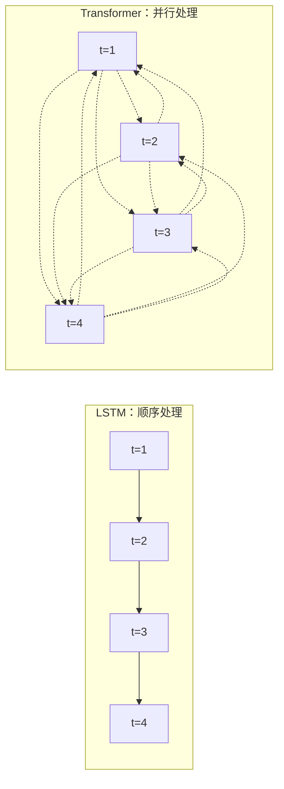
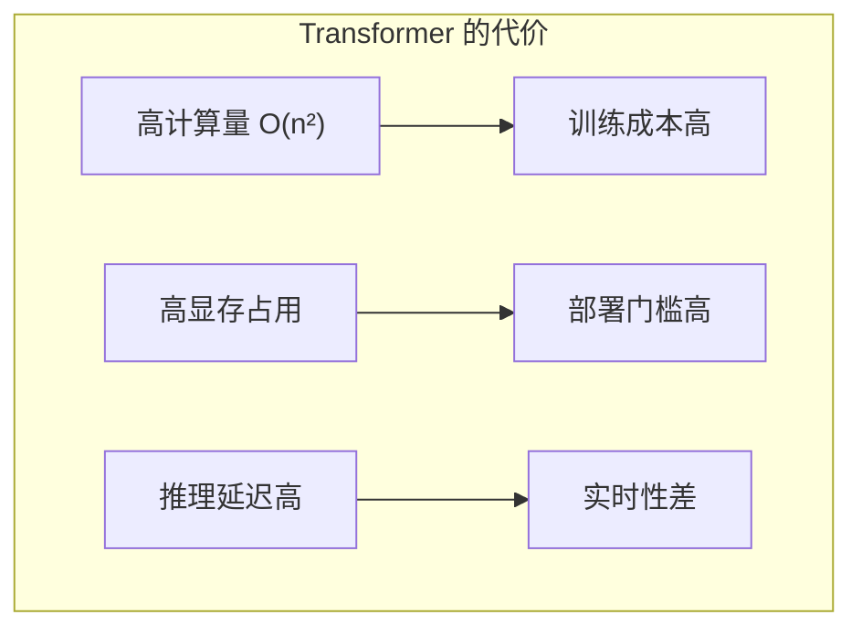
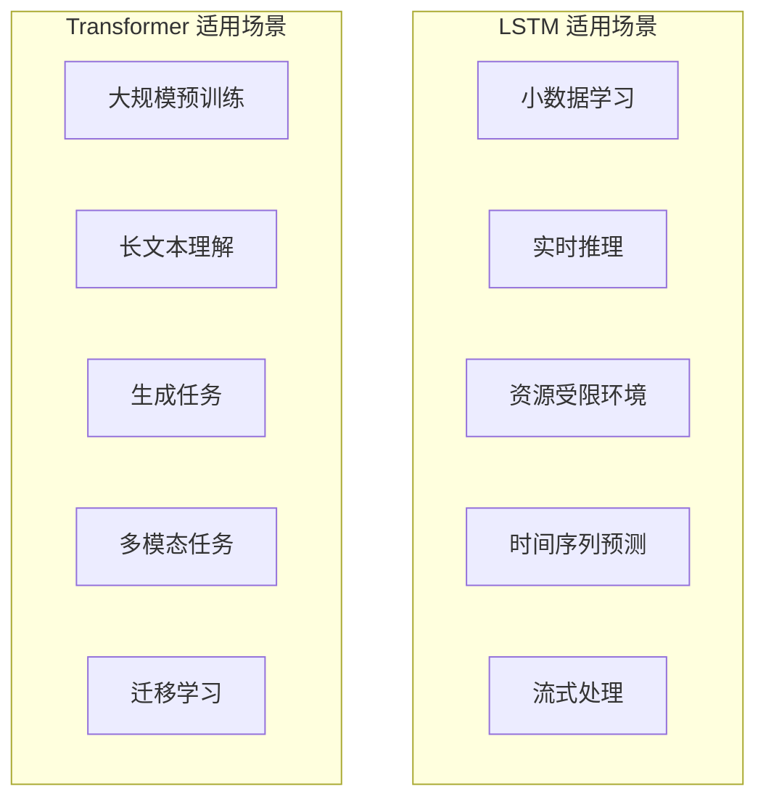
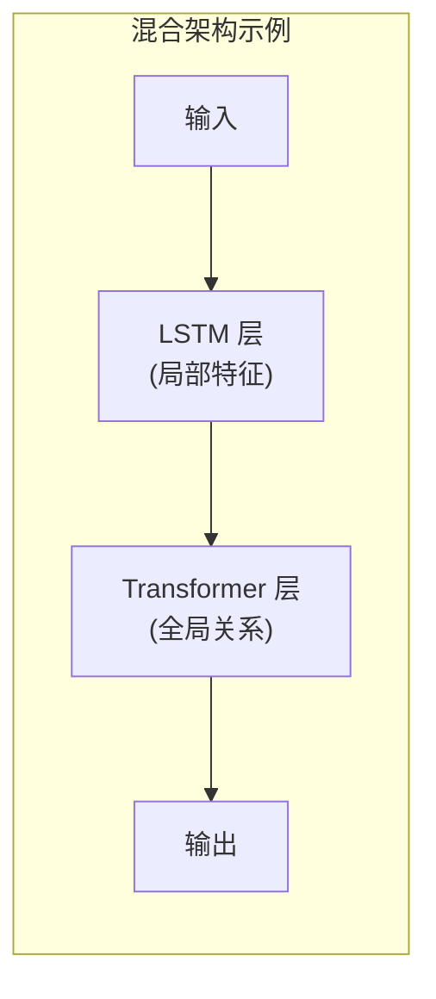
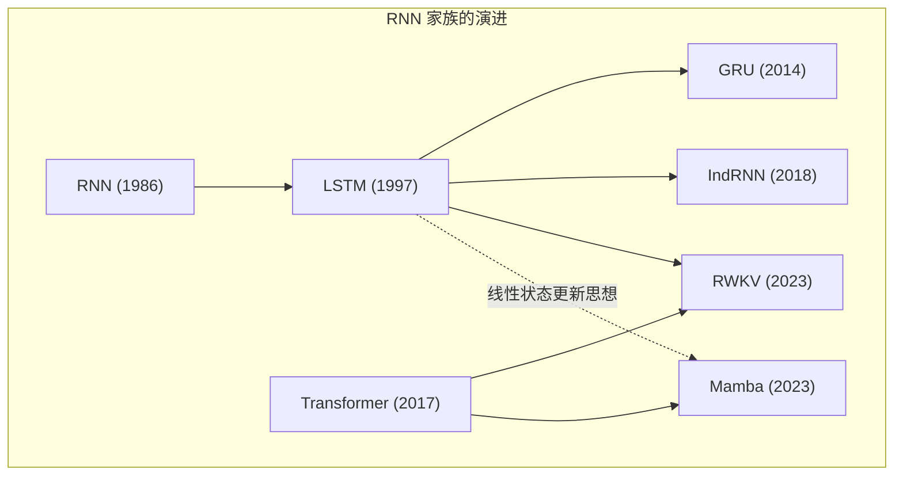
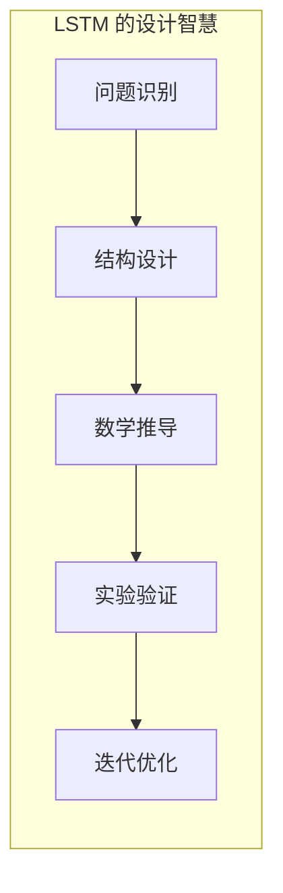
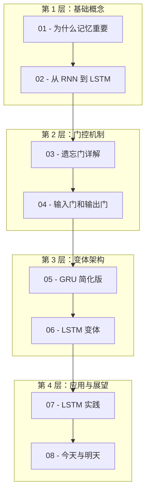

# 08 - LSTM 的今天与明天：Transformer 时代，LSTM 还有用吗？

问下大家，现在都 2024 年了，满大街都是 Transformer、GPT、BERT，LSTM 还有存在的价值吗？

云言最近在做一个边缘设备的项目，发现卧槽，GPU 根本跑不动大模型！这时候 LSTM 这种"小而美"的架构，反而成了救命稻草。

今天我们来聊聊：在 Transformer 统治的时代，LSTM 到底还有什么用？它的未来在哪里？作为系列的最后一篇，我们也会回顾整个学习旅程。

## Transformer 崛起，LSTM 就没用了？

先说结论：**LSTM 没有"死"，只是有了新的定位。**

### 为什么 Transformer 这么火？

2017 年，Google 发表了《Attention Is All You Need》，Transformer 横空出世，彻底改变了 NLP 的格局。

**Transformer 的核心优势：**

| 特点 | LSTM | Transformer |
|------|------|-------------|
| **并行计算** | ❌ 必须顺序处理 | ✅ 所有位置同时计算 |
| **长距离依赖** | ⚠️ 依赖门控调节 | ✅ 注意力直接连接 |
| **预训练能力** | ❌ 难以大规模预训练 | ✅ 完美支持 |
| **可扩展性** | ❌ 难以堆很深 | ✅ 可以堆到 100+ 层 |
| **参数效率** | ✅ 参数较少 | ❌ 参数量巨大 |



**Transformer 赢在：并行训练 + 大规模预训练。**

这就是为什么 GPT、BERT、LLaMA 这些大模型都是基于 Transformer 的。

### 但 Transformer 有代价

Transformer 不是银弹，它有自己的问题：

#### 问题一：计算量爆炸

自注意力的复杂度是 O(n²)，n 是序列长度。

```python
# 计算量对比
def lstm_flops(seq_len, hidden_size):
    """LSTM 计算量：线性增长"""
    return seq_len * hidden_size * hidden_size * 4  # 4 个门

def transformer_flops(seq_len, hidden_size):
    """Transformer 计算量：二次方增长"""
    attention = seq_len * seq_len * hidden_size  # 注意力矩阵
    ffn = seq_len * hidden_size * hidden_size * 2  # FFN
    return attention + ffn

# 对比
for seq_len in [128, 512, 2048, 8192]:
    lstm = lstm_flops(seq_len, 512)
    trans = transformer_flops(seq_len, 512)
    ratio = trans / lstm
    print(f"序列长度 {seq_len:>5}: LSTM {lstm/1e6:>6.1f}M, Transformer {trans/1e9:>5.2f}G, 比值 {ratio:>6.1f}x")

# 输出：
# 序列长度   128: LSTM   67.1M, Transformer  0.13G, 比值    2.0x
# 序列长度   512: LSTM  268.4M, Transformer  1.07G, 比值    4.0x
# 序列长度  2048: LSTM 1073.7M, Transformer  9.44G, 比值    8.8x
# 序列长度  8192: LSTM 4295.0M, Transformer 151.00G, 比值   35.2x
```

**看到了吗？序列越长，Transformer 的计算量增长越恐怖！**

#### 问题二：推理延迟高

Transformer 的推理需要计算所有位置的注意力，内存带宽压力大。

LSTM 只需要维护一个隐藏状态，推理极其高效。

#### 问题三：资源门槛高

训练一个像样的 Transformer，需要：
- 数千张 GPU
- 数月时间
- 数百万美元

LSTM？一张普通显卡就能跑。



## LSTM 的优势场景

既然 Transformer 有这些问题，LSTM 在哪里还能发光发热？

### 场景一：小数据学习

**当数据量有限时，LSTM 往往比 Transformer 更好。**

| 数据量 | 模型选择 | 原因 |
|--------|---------|------|
| < 1万样本 | ✅ LSTM | 参数少，不易过拟合 |
| 1万-10万 | ⚠️ 都可以 | 看具体任务 |
| > 10万 | ✅ Transformer | 数据足够，发挥优势 |

```python
# 小数据场景的实验
import numpy as np

# 生成小数据集
def generate_small_dataset(n_samples=1000, seq_len=20):
    """生成一个小型序列分类数据集"""
    X = np.random.randn(n_samples, seq_len, 10)
    # 任务：判断序列中是否有特定模式
    Y = (np.sum(X[:, :5, 0] > 0, axis=1) > 3).astype(int)
    return X, Y

# 小数据集上，LSTM 的参数效率更高
# 一个小型 LSTM: ~10K 参数
# 一个小型 Transformer: ~100K 参数（还没算注意力矩阵）

# 小数据 + 大模型 = 过拟合
```

**经验法则：数据量 < 10 倍参数量，优先考虑 LSTM。**

### 场景二：实时推理

**需要低延迟响应的场景，LSTM 是首选。**

典型应用：
- 实时语音识别
- 在线手写识别
- 实时手势识别
- 嵌入式设备的时序预测

```python
# 推理延迟对比
import time
import numpy as np

class SimpleLSTM:
    def __init__(self, hidden_size=64):
        self.h = np.zeros((hidden_size, 1))
        self.c = np.zeros((hidden_size, 1))
        # ... 参数初始化省略
    
    def step(self, x):
        """单步推理：只处理当前输入"""
        # 更新 h, c
        return self.h

class SimpleTransformer:
    def forward(self, X):
        """需要整个序列才能推理"""
        # 计算注意力矩阵
        # 需要 O(n²) 时间
        pass

# LSTM 的优势：流式处理
# 每来一个新输入，立即输出结果
# Transformer 需要 buffer 整个序列
```

**LSTM 天然支持流式处理，这是它的杀手锏。**

### 场景三：资源受限环境

**在边缘设备、嵌入式系统上，LSTM 是主力。**

| 环境 | 内存限制 | 模型选择 |
|------|---------|---------|
| 服务器 GPU | > 10GB | ✅ Transformer |
| 移动端 GPU | 2-4GB | ⚠️ 小型 Transformer |
| CPU | < 1GB | ✅ LSTM |
| 微控制器 | < 100KB | ✅ 量化 LSTM |

```python
# 模型大小对比
def count_parameters(hidden_size, num_layers=1, model_type='lstm'):
    """计算参数量"""
    if model_type == 'lstm':
        # LSTM 每层参数：4 * (input_size + hidden_size + 1) * hidden_size
        # 简化计算：假设 input_size = hidden_size
        return num_layers * 4 * (hidden_size + hidden_size + 1) * hidden_size
    elif model_type == 'transformer':
        # Transformer 参数量取决于头数、FFN 维度等
        # 粗略估计：每层约 6-12 倍 hidden_size²
        return num_layers * 8 * hidden_size * hidden_size

# 对比
hidden_size = 128
lstm_params = count_parameters(hidden_size, model_type='lstm')
trans_params = count_parameters(hidden_size, model_type='transformer')

print(f"Hidden size: {hidden_size}")
print(f"LSTM 参数量: {lstm_params:,} ({lstm_params * 4 / 1024:.1f} KB)")
print(f"Transformer 参数量: {trans_params:,} ({trans_params * 4 / 1024:.1f} KB)")
print(f"比例: {trans_params / lstm_params:.1f}x")
```

### 场景四：特定任务

**有些任务，LSTM 的归纳偏置反而更有利。**

| 任务 | LSTM 表现 | Transformer 表现 | 推荐 |
|------|----------|-----------------|------|
| 机器翻译 | ⭐⭐⭐ | ⭐⭐⭐⭐⭐ | Transformer |
| 文本生成 | ⭐⭐ | ⭐⭐⭐⭐⭐ | Transformer |
| 时间序列预测 | ⭐⭐⭐⭐ | ⭐⭐⭐ | LSTM |
| 异常检测 | ⭐⭐⭐⭐ | ⭐⭐⭐ | LSTM |
| 语音识别 | ⭐⭐⭐⭐ | ⭐⭐⭐⭐ | 都可以 |
| 手写识别 | ⭐⭐⭐⭐⭐ | ⭐⭐⭐ | LSTM |

**LSTM 在"局部模式 + 长期依赖"的任务上表现出色。**

## LSTM vs Transformer：全面对比

来一个全面的对比表格：



### 详细对比

| 维度 | LSTM | Transformer | 赢家 |
|------|------|-------------|------|
| **训练并行度** | ❌ 顺序训练 | ✅ 完全并行 | Transformer |
| **推理延迟** | ✅ O(1) 每步 | ⚠️ O(n) 或 O(n²) | LSTM |
| **长距离依赖** | ⚠️ 依赖门控 | ✅ 直接连接 | Transformer |
| **参数效率** | ✅ 高 | ❌ 低 | LSTM |
| **小数据表现** | ✅ 好 | ⚠️ 容易过拟合 | LSTM |
| **可解释性** | ⚠️ 中等 | ❌ 较低 | LSTM |
| **预训练能力** | ❌ 难 | ✅ 完美 | Transformer |
| **迁移学习** | ⚠️ 有限 | ✅ 强大 | Transformer |
| **部署门槛** | ✅ 低 | ⚠️ 高 | LSTM |

### 选择指南

```python
def choose_model(data_size, seq_length, latency_req, compute_budget):
    """模型选择决策树"""
    
    # 情况 1：极低延迟要求
    if latency_req < 10:  # 毫秒
        return "LSTM (流式处理)"
    
    # 情况 2：超长序列
    if seq_length > 8192:
        return "Transformer 变体 (如 Longformer, Linformer)"
    
    # 情况 3：小数据 + 有限计算
    if data_size < 10000 and compute_budget == 'low':
        return "LSTM (参数高效)"
    
    # 情况 4：大规模预训练
    if data_size > 1000000 and compute_budget == 'high':
        return "Transformer (预训练优势)"
    
    # 情况 5：边缘设备
    if compute_budget == 'tiny':
        return "量化 LSTM"
    
    # 默认
    return "视具体任务而定"
```

## LSTM 的演进：与 Transformer 的融合

LSTM 并没有停滞不前，它在进化。

### 方向一：与 Transformer 结合

**混合架构：取两者之长。**



典型设计：
- **LSTM 提取局部时序特征** → 减少序列长度
- **Transformer 建模全局依赖** → 捕获长距离关系

```python
# 混合架构示意
class LSTMTransformerHybrid:
    """
    LSTM + Transformer 混合架构
    - LSTM 先处理局部模式
    - Transformer 再建模全局关系
    """
    def __init__(self, hidden_size=128, num_heads=4):
        self.lstm = LSTMCell(hidden_size)
        self.attention = MultiHeadAttention(hidden_size, num_heads)
    
    def forward(self, X):
        # 1. LSTM 处理局部模式
        lstm_outputs = []
        h, c = None, None
        for x in X:
            h, c = self.lstm(x, h, c)
            lstm_outputs.append(h)
        lstm_outputs = torch.stack(lstm_outputs)
        
        # 2. Transformer 建模全局关系
        attn_output = self.attention(lstm_outputs, lstm_outputs, lstm_outputs)
        
        return attn_output
```

### 方向二：高效的 Transformer 变体

**借鉴 LSTM 的思想优化 Transformer。**

| 变体 | 思想 | 效果 |
|------|------|------|
| **Transformer-XL** | 引入段级递归 | 处理超长序列 |
| **Linear Transformer** | 线性化注意力 | O(n) 复杂度 |
| **Performer** | 核方法近似 | 高效长序列 |
| **Reformer** | LSH 注意力 | 省内存 |

### 方向三：新的 RNN 变体

**LSTM 的精神在延续。**

| 模型 | 创新 | 年份 |
|------|------|------|
| **IndRNN** | 独立循环神经元 | 2018 |
| **SRU** | 简化循环单元 | 2018 |
| **Quasi-RNN** | 准 RNN | 2016 |
| **RWKV** | RNN + Transformer 结合 | 2023 |
| **Mamba** | 状态空间模型 | 2023 |

**特别值得关注：RWKV 和 Mamba。**

```python
# RWKV：RNN 训练并行化 + RNN 推理高效
# 核心：Linear Attention 的 RNN 形式
# 优势：训练像 Transformer 一样并行，推理像 RNN 一样高效

# Mamba：状态空间模型
# 核心：选择性状态空间 + 线性复杂度
# 优势：超长序列 + 高效推理

# 这两个模型都继承了 LSTM 的"线性状态更新"思想
```



## 为什么学习 LSTM 仍然重要

既然 Transformer 这么强，为什么还要学 LSTM？

### 理由一：理解基础

**LSTM 是理解现代架构的基石。**

| 现代 | 继承自 LSTM 的思想 |
|------|------------------|
| Transformer 的 Add & Norm | 类似 LSTM 的残差流动 |
| Gated MLP | 门控机制 |
| RWKV 的状态更新 | LSTM 的细胞状态 |
| Mamba 的选择性 | LSTM 的门控选择 |

**不学 LSTM，很多现代论文的动机看不懂。**

### 理由二：面试必考

**LSTM 是深度学习面试的高频考点。**

常见面试题：
1. LSTM 如何解决梯度消失？（细胞状态线性流动）
2. 遗忘门为什么初始化为 1？（避免一开始就遗忘）
3. LSTM 和 GRU 的区别？（参数量、性能权衡）
4. LSTM 适合什么场景？（小数据、实时、资源受限）

### 理由三：实践价值

**很多生产环境还在用 LSTM。**

- 语音识别系统
- 时间序列预测
- 异常检测
- 嵌入式 AI
- ...

### 理由四：思维训练

**LSTM 的设计哲学值得学习。**



LSTM 教会我们：
- 如何识别问题（长期依赖）
- 如何设计解决方案（门控 + 细胞状态）
- 如何验证设计（梯度流分析）

这种思维模式，适用于任何架构设计。

## LSTM 会消失吗？

**不会。它会像 C 语言一样，成为基础设施的一部分。**

### 预测一：LSTM 成为"底层原语"

就像现在很少人直接用 C 语言开发应用，但操作系统、编译器都是 C 写的。

LSTM 可能成为：
- 嵌入式 AI 的标准组件
- 实时系统的首选架构
- 混合架构的基础模块

### 预测二：门控思想永恒

**门控机制（Gating）是深度学习的核心思想之一。**

- LSTM：遗忘门、输入门、输出门
- GRU：更新门、重置门
- GLU（Gated Linear Unit）：语言模型常用
- Gated MLP：MoE 架构的基础
- Mamba：选择性门控

**学会 LSTM 的门控，理解了一整个类别的架构。**

### 预测三：特定领域的主力

在某些领域，LSTM 会长期存在：

| 领域 | LSTM 的角色 |
|------|------------|
| 嵌入式 AI | ✅ 主力架构 |
| 时间序列 | ✅ 基线模型 |
| 语音处理 | ✅ 核心组件 |
| 教育入门 | ✅ 教学首选 |

## 系列总结：我们学到了什么

到这里，《图解 LSTM 网络》系列就告一段落了。让我们回顾整个旅程。

### 知识脉络



### 核心收获

**一、理解了"为什么"**

| 问题 | 答案 |
|------|------|
| 为什么需要记忆？ | 序列数据需要历史信息 |
| 为什么 RNN 会遗忘？ | 梯度消失 + 信息稀释 |
| 为什么 LSTM 能解决？ | 门控 + 细胞状态 |

**二、掌握了"怎么做"**

| 门控 | 功能 | 公式 |
|------|------|------|
| 遗忘门 | 选择性遗忘 | f_t = σ(W_f·[h_{t-1}, x_t]) |
| 输入门 | 选择性记忆 | i_t = σ(W_i·[h_{t-1}, x_t]) |
| 输出门 | 选择性输出 | o_t = σ(W_o·[h_{t-1}, x_t]) |
| 细胞状态 | 长期存储 | c_t = f_t * c_{t-1} + i_t * c̃_t |

**三、学会了"选什么"**

| 场景 | 选择 |
|------|------|
| 大规模预训练 | Transformer |
| 小数据学习 | LSTM |
| 实时推理 | LSTM |
| 长文本理解 | Transformer |
| 边缘设备 | LSTM |
| 生成任务 | Transformer |

### 学习建议

**如果你是初学者：**

1. 先跑通一个最小 LSTM 示例
2. 用简单任务测试记忆能力
3. 可视化门控激活，理解其行为
4. 对比 RNN 和 LSTM 的梯度流

**如果你是实践者：**

1. 掌握 LSTM 的 PyTorch/TensorFlow 实现
2. 了解不同变体的权衡
3. 学会在正确场景选择正确模型
4. 关注混合架构的可能性

**如果你是研究者：**

1. 深入理解梯度流理论
2. 研究门控设计空间
3. 关注 RNN 家族的新发展（RWKV, Mamba）
4. 探索 LSTM 与 Transformer 的融合

### 延伸阅读

**必读论文：**

1. **Hochreiter & Schmidhuber (1997)** - "Long Short-Term Memory"
   - LSTM 的原始论文

2. **Cho et al. (2014)** - "Learning Phrase Representations using RNN Encoder-Decoder"
   - GRU 的提出

3. **Vaswani et al. (2017)** - "Attention Is All You Need"
   - Transformer 的诞生

4. **Peng et al. (2023)** - "RWKV: Reinventing RNNs for the Transformer Era"
   - RNN 的新方向

**推荐教程：**

1. Christopher Olah - "Understanding LSTM Networks"（本系列灵感来源）
2. Andrej Karpathy - "The Unreasonable Effectiveness of RNNs"
3. Goodfellow et al. - "Deep Learning" 第 10 章

## 结语

感谢你读到这里！

从第一篇的"为什么记忆重要"，到这篇的"LSTM 的未来"，我们一起走完了 LSTM 的学习旅程。

**LSTM 教会我们的，不仅仅是记忆机制，更是一种思维方式：**

- 识别问题的本质
- 设计精巧的结构
- 用数学验证直觉
- 在权衡中寻找最优解

这种思维，适用于任何深度学习架构，无论是 Transformer、Diffusion，还是未来可能出现的新范式。

**LSTM 或许不再是"主角"，但它的思想永不过时。**

门控机制、细胞状态、选择性记忆...这些概念已经融入深度学习的基因，在每一个新架构中都能看到它们的影子。

**最后，一个问题留给你：**

> 如果让你设计一个新的序列模型，你会从 LSTM 学到什么？

欢迎思考，也欢迎在评论区分享你的想法。

---

**系列完结！感谢一路相伴！**

**如果你觉得这个系列有帮助，欢迎分享给更多朋友！**

---

## 系列导航

**基础概念篇：**
- [01 - 为什么记忆重要？](01-why-memory-matters.md)
- [02 - 从 RNN 到 LSTM](02-from-rnn-to-lstm.md)

**门控机制篇：**
- [03 - 遗忘门详解](03-forget-gate-explained.md)
- [04 - 输入门和输出门](04-input-output-gates.md)

**变体架构篇：**
- [05 - GRU：简化版 LSTM](05-gru-simplified-lstm.md)
- [06 - LSTM 变体探索](06-peephole-and-variants.md)

**应用与展望篇：**
- [07 - LSTM 实践应用](07-lstm-in-practice.md)
- [08 - LSTM 的今天与明天](08-lstm-today-and-tomorrow.md) ← 你在这里

**深度解读系列：**
- [LSTM 梯度流理论](dive-01-lstm-gradient-flow.md)
- [门控设计空间](dive-02-gating-design-space.md)
- [从 LSTM 到 Transformer 的范式转移](dive-03-lstm-to-transformer-paradigm.md)

---

*关注「云言 AI」公众号，获取更多 AI 和深度学习相关的图解教程！*

*本教程遵循 Creative Commons BY-NC-SA 4.0 协议*